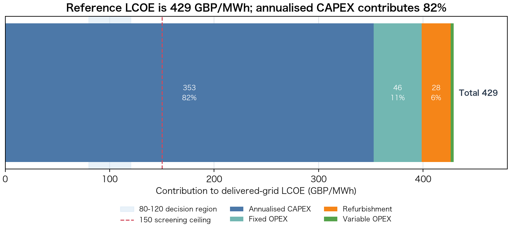
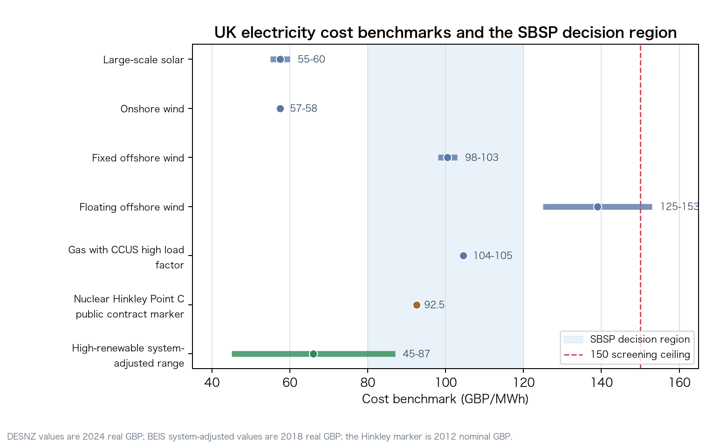
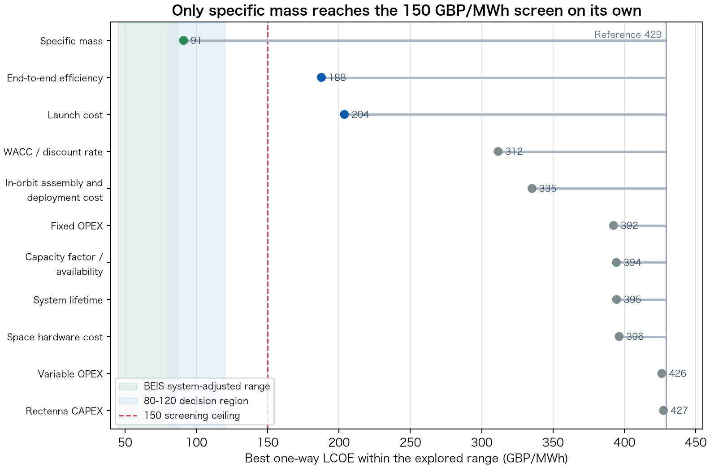
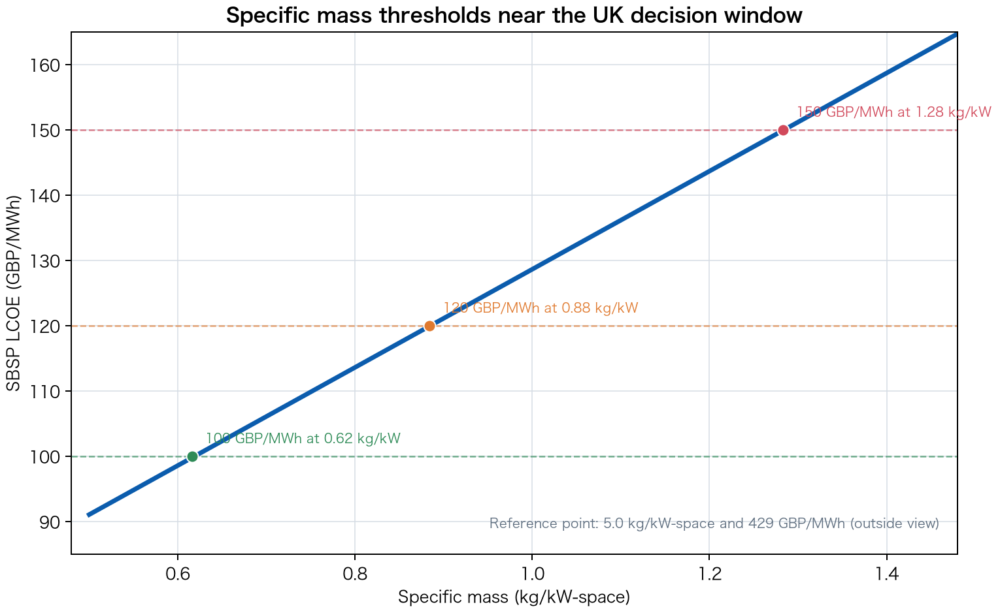
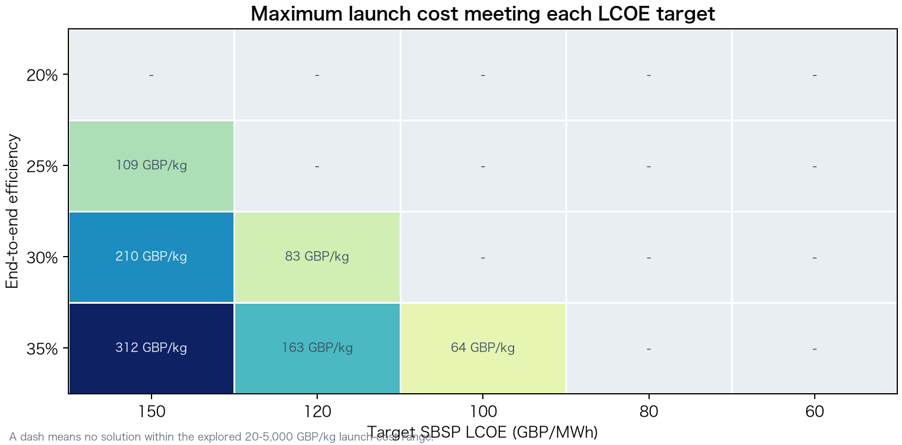
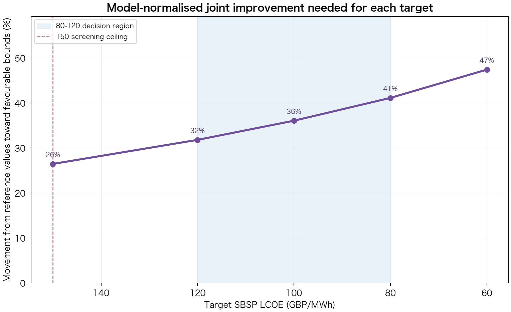
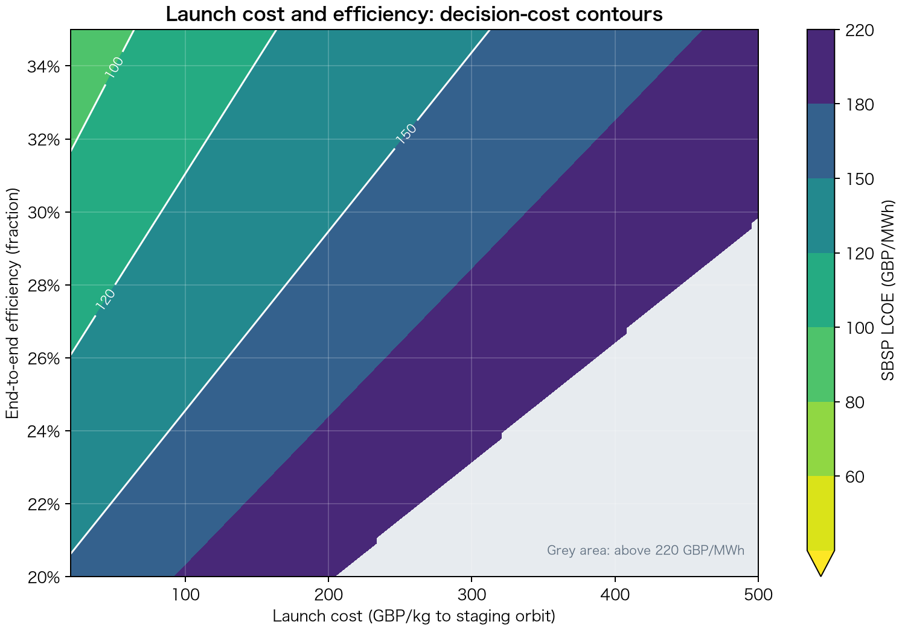
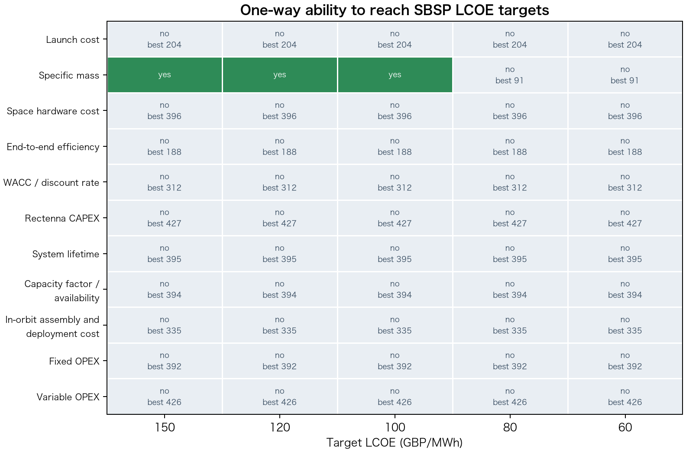

# UK Space-Based Solar Power Cost-Threshold Assessment

Report subtitle: Decision-focused techno-economic assessment for UK firm low-carbon electricity

Evidence status: Project evidence registry and official source files reviewed to 10 July 2026.

Version: v1.1 decision-window revision

Prepared as: A reproducible threshold assessment using the project data and model pipeline.

Disclaimer: This report identifies cost conditions for further assessment. It does not establish engineering feasibility, commercial readiness or investment merit.

[[PAGEBREAK]]

## Table of Contents

- 1. Executive Decision Summary
- 2. Scope and Method
- 3. Reference Case and Cost Structure
- 4. UK Cost Benchmarks
- 5. One-way Cost Thresholds
- 6. Combined Bottleneck Thresholds
- 7. Decision Interpretation and Limitations
- Appendix A. Full One-way Diagnostic
- Appendix B. Source Registry
- Appendix C. Assumption Classification

[[PAGEBREAK]]

## 1. Executive Decision Summary

The reference case produces delivered-grid LCOE of 429 GBP/MWh. It is an analytical anchor, not a forecast or preferred design. The useful result is the threshold structure below it.

Table 1. Cost gates and their decision meaning

| Cost gate | Interpretation | Decision meaning |
| --- | --- | --- |
| Below 150 GBP/MWh | Broad screening ceiling | Approaches the upper comparator range; not a competitiveness claim |
| 100-120 GBP/MWh | Firm low-carbon decision region | Warrants engineering, finance and GB system-value assessment |
| 80 GBP/MWh or below | Conservative system-adjusted overlap | Cost is relevant, but price-basis and system-value checks still apply |
| 60 GBP/MWh | Stringent stretch test | Requires simultaneous movement across most bottlenecks |

Three conclusions drive the assessment:

- Only specific mass reaches the 150 GBP/MWh screen by itself. With all other inputs fixed, the thresholds are 1.28 kg/kW-space at 150 GBP/MWh, 0.88 at 120, and 0.62 at 100.
- Launch cost alone bottoms out at 204 GBP/MWh even at 20 GBP/kg. End-to-end efficiency alone bottoms out at 188 GBP/MWh at 35 percent efficiency.
- Reaching the 80-120 GBP/MWh region requires coordinated improvement in mass, efficiency, launch, assembly, orbital hardware and finance.

Entering 80-120 GBP/MWh would justify deeper engineering and GB power-system modelling. It would not by itself establish market competitiveness.

## 2. Scope and Method

The model asks what launch cost, mass intensity, hardware cost, assembly cost, efficiency, utilisation, lifetime, OPEX and financing conditions would be required for SBSP to approach UK electricity cost benchmarks.

The boundary is delivered-grid LCOE. Annualised initial CAPEX, fixed OPEX, refurbishment and variable OPEX are divided by annual delivered MWh. Delivered electricity equals capacity x 8,760 x capacity factor; required space-side power equals delivered capacity divided by end-to-end efficiency; orbital mass equals space-side power multiplied by specific mass.

The model identifies cost parity only. Engineering achievability, beam and spectrum regulation, construction delivery, commercial financeability and whole-system value require separate tests.

## 3. Reference Case and Cost Structure

Table 2. Core reference inputs

| Parameter | Reference value | Role |
| --- | --- | --- |
| Delivered grid capacity | 2,000 MW | Scale anchor |
| End-to-end efficiency | 15.0% | Sets space-side power and mass |
| Capacity factor / availability | 90.0% | Sets annual delivered electricity |
| Specific mass | 5.0 kg/kW-space | Multiplies launch, transfer and assembly cost |
| Launch cost | 500 GBP/kg to staging orbit | Primary transport-cost lever |
| Space hardware cost | 0.40 GBP/W-space | Orbital manufacturing-cost lever |
| In-orbit assembly and deployment cost | 200 GBP/kg | Mass-scaled deployment cost |
| WACC / discount rate | 6.5% | Annualises the capital base |
| System lifetime | 30 years | Capital recovery period |

At this point, 2 GW delivered output requires 13.33 GW of space-side power and about 66,667 tonnes of orbital hardware.

[[PAGEBREAK]]

Table 3. Initial CAPEX, including programme margin

| Component | GBP billion |
| --- | --- |
| Launch | 33.33 |
| In-orbit assembly and deployment | 13.33 |
| Orbit transfer | 6.67 |
| Space segment CAPEX | 5.33 |
| Wireless power transmission | 1.33 |
| Rectenna | 0.30 |
| Grid connection | 0.20 |
| Pre-margin subtotal | 60.50 |
| Programme margin / contingency | 12.10 |
| Initial CAPEX total | 72.60 |

Annualised CAPEX contributes about 82 percent of reference LCOE. This is why mass, scale, hardware cost and financing dominate the threshold result.

The reference inputs are exploratory because commercial-scale SBSP has not been deployed. They answer what would have to change, not what will happen.

## 4. UK Cost Benchmarks

Ranges are shown as intervals rather than zero-based bars. The 80-120 GBP/MWh region is a decision window, while 150 GBP/MWh is only a broad screening ceiling.

Table 4. Benchmark interpretation

| Comparator | Indicative GBP/MWh | Price basis | Use |
| --- | --- | --- | --- |
| DESNZ generation range | 55-153 | 2024 real GBP | Generator-boundary comparison |
| Core mature generation range | 55-113 | 2024 real GBP | Headline generation-cost screen |
| BEIS renewable system-adjusted range | 45-87 | 2018 real GBP | Conservative indicator; not a complete GB system model |
| Firm low-carbon markers | 92.5 contract; 104-105 CCUS | Mixed price bases | Context only; not a single like-for-like benchmark |

DESNZ generation costs and BEIS enhanced-LCOE values are not on the same real-price basis. The chart labels that difference explicitly; exact overlap should not be read as price-normalised parity. Wider grid, balancing, curtailment, storage and reliability costs also require a full GB system model.

## 5. One-way Cost Thresholds

One-way analysis changes one input while holding all others at the reference point. It is a leverage test, not a development plan.

The figure removes high-cost deterioration ranges and compares only the most favourable result for each input. Specific mass is the only one-way lever that crosses the 150 GBP/MWh screen.

The view is restricted to the part of the curve that crosses 150, 120 and 100 GBP/MWh. The 5.0 kg/kW-space reference point is deliberately noted outside the plotting window.

At 25 percent efficiency, 150 GBP/MWh requires launch cost of about 109 GBP/kg or lower. At 35 percent efficiency, 100 GBP/MWh requires about 64 GBP/kg. Dashes indicate no solution in the explored launch-cost range.

The pattern is unambiguous: low launch cost applied to a heavy, inefficient architecture is still too expensive. Mass and efficiency change the scale on which transport and assembly costs act.

## 6. Combined Bottleneck Thresholds

The combined frontier moves model inputs by an equal fraction from their reference values toward the favourable ends of their documented ranges. The percentage below is a model-normalised parameter movement, not technology maturity, probability or calendar progress.

Table 5. Selected combined-threshold points

| Target GBP/MWh | Normalised movement | Launch GBP/kg | Mass kg/kW | Efficiency | WACC |
| --- | --- | --- | --- | --- | --- |
| 150 | 26% | 373 | 3.81 | 20% | 5.6% |
| 120 | 32% | 347 | 3.57 | 21% | 5.4% |
| 100 | 36% | 327 | 3.38 | 22% | 5.2% |
| 80 | 41% | 303 | 3.15 | 23% | 5.1% |

Moving from the 150 screen into the 80-120 decision region tightens several physical and financial constraints together.

The chart displays only 220 GBP/MWh and below; higher-cost space is neutral grey. It shows the limited launch-cost window associated with 150, 120, 100 and 80 GBP/MWh contours.

These combinations are illustrative slices through parameter space, not engineering roadmaps. Alternative slices remain available in `data/processed/alternative_combined_pathways.csv`.

## 7. Decision Interpretation and Limitations

SBSP is most relevant to the UK if it can provide firm or near-firm low-carbon output. In that role, the comparison is with reliable delivered electricity, gas CCUS, nuclear-like firm supply, long-duration flexibility and the system-adjusted cost of a high-renewable system - not only bare wind and solar LCOE.

The practical decision rule is: below 150 GBP/MWh, continue threshold monitoring; in the 100-120 region, undertake integrated engineering and finance review; at 80 GBP/MWh or below, add detailed GB dispatch, network and reliability modelling.

The main uncertainties are architecture feasibility, cost-range credibility, financing risk, lifetime and degradation, beam and regulatory constraints, and the value of firm output in a future GB system. Price-basis differences between the 2018 BEIS and 2024 DESNZ comparators remain explicit rather than silently harmonised.

The central conclusion is therefore narrow: SBSP does not become decision-relevant through launch-cost reduction alone. It becomes worth deeper assessment only when a credible integrated architecture enters roughly 80-120 GBP/MWh delivered-grid LCOE.

[[PAGEBREAK]]

## Appendix A. Full One-way Diagnostic

The report focuses on decision-relevant views. Full sensitivity curves remain in `figures/`, and all curve points remain in `data/processed/sensitivity_curves.csv`.

The matrix retains the complete one-way audit across all five targets and eleven varied inputs.

Appendix Table A1. Full one-way threshold summary

| Driver | Unit | 150 threshold | 100 threshold | Best one-way LCOE |
| --- | --- | --- | --- | --- |
| Launch cost | GBP/kg to staging orbit | not reached | not reached | 204 |
| Specific mass | kg/kW-space | 1.283 | 0.616 | 91 |
| Space hardware cost | GBP/W-space | not reached | not reached | 396 |
| End-to-end efficiency | fraction | not reached | not reached | 188 |
| WACC / discount rate | fraction | not reached | not reached | 312 |
| Rectenna CAPEX | GBP/W-delivered | not reached | not reached | 427 |
| System lifetime | years | not reached | not reached | 395 |
| Capacity factor / availability | fraction | not reached | not reached | 394 |
| In-orbit assembly and deployment cost | GBP/kg | not reached | not reached | 335 |
| Fixed OPEX | fraction/year | not reached | not reached | 392 |
| Variable OPEX | GBP/MWh | not reached | not reached | 426 |

[[PAGEBREAK]]

## Appendix B. Source Registry

Appendix Table B1. Source registry

| Source ID | Reference | URL |
| --- | --- | --- |
| DESNZ_EGC_2025 | DESNZ, Electricity generation costs 2025 | https://www.gov.uk/government/publications/electricity-generation-costs-2025 |
| BEIS_EGC_2020 | BEIS, Electricity Generation Costs 2020 | https://www.gov.uk/government/publications/beis-electricity-generation-costs-2020 |
| NESO_BALANCING_2025 | NESO, 2025 Annual Balancing Costs Report | https://www.neso.energy/document/362561/download |
| NESO_NETWORK_UPDATE_2026 | NESO, Beyond 2030 Electricity Transmission Update | https://www.neso.energy/publications/beyond-2030 |
| NESO_CP2030 | NESO, Clean Power 2030 advice and implementation material | https://www.neso.energy/publications/clean-power-2030 |
| NESO_OPERABILITY_2026 | NESO, Operability Strategy Report and Electricity Markets Roadmap | https://www.neso.energy/publications/operability-strategy-report-and-electricity-markets-roadmap |
| UKSA_SBSP_2020 | UK Space Agency and BEIS, SBSP research commission | https://www.gov.uk/government/news/uk-government-commissions-space-solar-power-stations-research |
| CALTECH_SBSP_2022 | Caltech SBSP technical concept paper | https://arxiv.org/abs/2206.08373 |
| NAO_HPC_2017 | National Audit Office, Hinkley Point C | https://www.nao.org.uk/reports/hinkley-point-c/ |

## Appendix C. Assumption Classification

All reference inputs in Table C1 are classified as exploratory modelling assumptions. Operating and grid-interface allowances remain documented in `data/sbsp_parameters.csv`; raw official workbooks and processed CSVs remain separate from model outputs.

Appendix Table C1. Decision-relevant reference inputs

| Parameter | Reference | Source | Interpretation |
| --- | --- | --- | --- |
| Delivered grid capacity | 2000.000 MW | `ASSUMPTION_THIS_STUDY` | Scale anchor. LCOE is mostly scale-neutral because most costs are specified per W or per kg. |
| End-to-end efficiency | 15.0% | `CALTECH_SBSP_2022` | Exploratory conversion from required space-side power to delivered grid output. |
| Capacity factor / availability | 90.0% | `ASSUMPTION_THIS_STUDY` | Availability assumption for a near-firm output profile, not measured SBSP operating history. |
| Specific mass | 5.000 kg/kW-space | `CALTECH_SBSP_2022` | Architecture-level mass intensity. This is the strongest one-way driver and remains highly uncertain. |
| Launch cost | 500.000 GBP/kg to staging orbit | `UKSA_SBSP_2020` | All-in launch-cost threshold variable. Treated as a wide exploratory range rather than a forecast price. |
| Space hardware cost | 0.400 GBP/W-space | `ASSUMPTION_THIS_STUDY` | Exploratory manufacturing-cost threshold for orbital collection, structure, control and conversion hardware. |
| WACC / discount rate | 6.5% | `DESNZ_EGC_2025` | Financing-cost variable anchored to infrastructure and higher-risk project-finance bounds. |
| System lifetime | 30.000 years | `ASSUMPTION_THIS_STUDY` | Economic operating life. Space degradation and refurbishment are represented separately. |
| In-orbit assembly and deployment cost | 200.000 GBP/kg | `UKSA_SBSP_2020` | Exploratory robotic assembly, deployment, inspection and commissioning cost. |
| Rectenna CAPEX | 0.150 GBP/W-delivered | `ASSUMPTION_THIS_STUDY` | Exploratory ground receiving and conversion cost per delivered W. |
