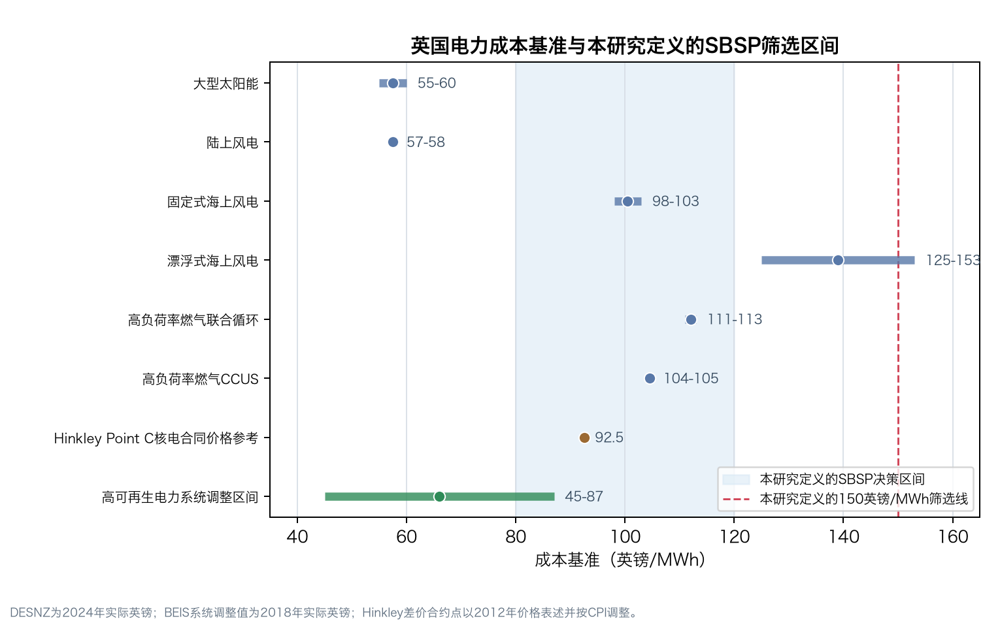
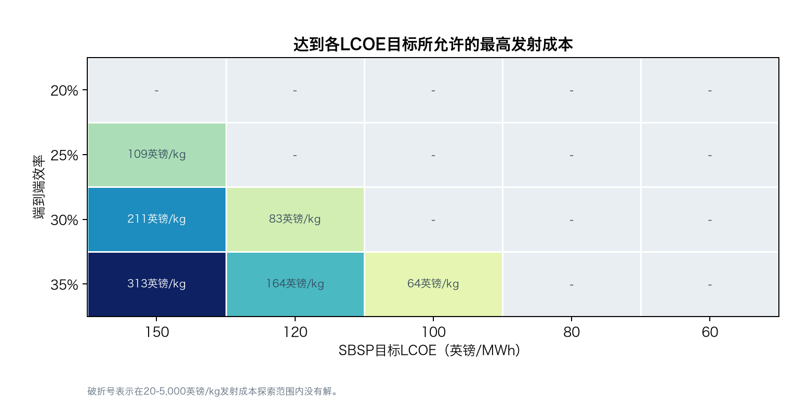
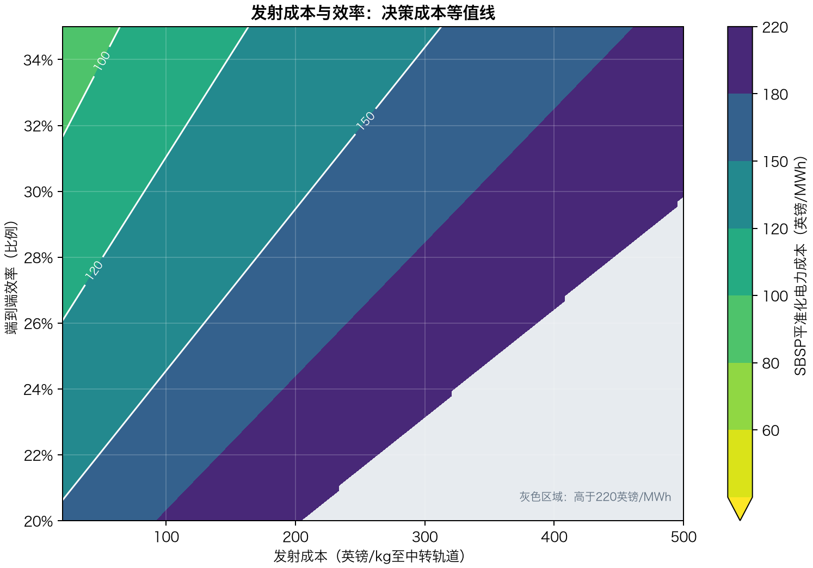

# 英国空间太阳能成本条件图

副标题：面向英国决策筛选的可复现门槛评估——不是部署预测

证据状态：来源登记表复核至2026-07-19；已对选定的官方DESNZ基准单元格进行程序对账。

版本号：v1.2

说明：中英文内容由同一组结构化数据和模型结果生成。

免责声明：本报告识别模型条件下的成本要求，不证明工程可实现性，不预测投产年份，不估算投资回报，也不构成投资建议。

<!-- PAGEBREAK -->

## 目录

- 1. 执行结论
- 2. 研究问题与本项目的特殊贡献
- 3. 范围、会计边界与方法
- 4. 证据质量与来源纪律
- 5. 参考锚点与成本结构
- 6. 英国成本参照
- 7. 一维条件门槛
- 8. 联合成本条件前沿
- 9. 对英国决策的含义
- 10. 局限、稳健性与不作出的主张
- 11. 结论
- 附录A–C：证据、来源与假设审计表

<!-- PAGEBREAK -->

## 1. 执行结论

最通俗的结论是：**参考配置很贵，但本项目的价值在于把“为什么贵、要改变到什么程度”算清楚。** 在本研究自定的参考点上，并网连接点LCOE为**£429/MWh**。它只是统一比较用的锚点，不是预测，也不是推荐方案。

表1. 本研究定义的成本线及其含义

| 成本线 | 本项目中的用途 | 决策含义与限制 |
| --- | --- | --- |
| £150/MWh | 本研究定义的宽口径筛选线 | 不是英国官方门槛 |
| £100–120/MWh | 用于筛选潜在稳定或近稳定电源角色的研究定义区间 | 进入更深入工程、融资与系统价值评估 |
| £80/MWh | 与所选系统调整参照开始重叠 | 仍不等于具备市场竞争力 |
| £60/MWh | 严格压力测试 | 测试的一维输入均未达到；联合案例仍属探索性 |

在本模型边界和所选范围内、其余输入全部固定时，比质量是最强的一维杠杆。达到£150、£120和£100/MWh时，整套轨道系统比质量分别不能高于1.28、0.88和0.62 kg/kW-空间端。探索范围内，单独改变比质量仍达不到£80或£60/MWh。

仅降低发射成本并不够：即使降到探索下界£20/kg，LCOE仍约为£204/MWh。仅把端到端效率提高到35%，LCOE仍约为£188/MWh。因此，应测试质量、发射、空间硬件、组装、融资、效率和交付电量之间的多种联动组合；本模型没有证明每个变量都必须改变。

本项目的贡献**不是预测得更准**，而是更透明、可复现地回答一个更窄的问题：在明确写出的模型里，空间太阳能进入英国相关决策区间，需要满足什么成本与性能条件？

## 2. 研究问题与本项目的特殊贡献

本报告审阅的代表性研究主要评估具体架构、未来年份情景、生命周期影响或系统路径。本项目与它们互补：用连续的一维和联合参数前沿，直接显示达到与达不到的条件，并把假设、来源和计算过程完整公开。

表2. 本项目与所选既有空间太阳能研究的关系

| 研究 | 主要分析类型 | 公开成本背景 | 与本项目的关系 |
| --- | --- | --- | --- |
| 英国空间太阳能二阶段经济研究（2021） | 架构与未来情景研究 | 2018年价格：£35–79/MWh，中央估计约£50/MWh；2 GW CASSIOPeiA、30年寿命、20%门槛收益率、2040投运情景 | 提供架构和情景背景；本项目补充连续的模型条件门槛 |
| 英国小规模空间太阳能研究（2025年完成、2026年发布） | 架构、路径与系统价值研究 | 2024年实际英镑：2030年£335–595/MWh、2035年£154–249/MWh、2040年£87–129/MWh | 提供当前外部一致性核对和具体架构驱动因素；本项目增加可审计的参数空间图 |
| NASA OTPS评估（2024） | 全生命周期成本与排放评估 | FY2022美元：RD1/RD2基线分别为$610/$1,590/MWh；组合有利假设下为$30/$80/MWh | 说明在NASA所选案例中，架构与组合假设可使生命周期成本变化约20倍；NASA数值未导入本模型 |
| 本项目（v1.2） | 可复现连续成本条件分析 | 本研究自定参考锚点£429/MWh；以数值求根得到£150/120/100/80/60每MWh条件线 | 独特贡献是可追溯、可执行、中英双语的条件图，而不是更准预测 |

本项目可以公开说明的优势是：

- 所有精确模型输入都归类为**本研究自定的探索性假设**；外部文献数值单独放在证据对应表中。
- 门槛采用高精度单调二分求根，不再把绘图网格精度误当成数值精度。
- 对16个变量和5条研究自定成本线，同时报告“能达到”和“范围内达不到”的结果。
- 联合前沿和3条替代参数切片说明，这不是只靠发射成本的故事。
- 数据、模型、图表、中英文报告和自动检查可以用一条命令重新生成。

因此，本项目对于“成本条件是什么”这个问题更透明，但不能声称普遍比具体架构研究更准确。

## 3. 范围、会计边界与方法

模型终点是**并网连接点**。模型包含空间硬件、无线输电硬件、发射、轨道转移、在轨组装、整流天线、本地并网、项目裕度、资本回收、固定运维、翻新和可变运维；不包含下游输电扩建、平衡、储能、弃电、可靠性服务、税务、退役成本、收入机制和已货币化的系统价值。

全部模型财务输入按2024年实际英镑解释。变量`wacc`实际是资本回收公式中的**实际项目贴现率代理变量**；税务、通胀和融资分层不在模型内。容量因子也是交付电量代理变量，综合可用率、停机和运行约束，并不是空间太阳能的实测可用率。

计算关系为：

- 年交付电量 = 并网容量 × 8,760小时 × 交付容量因子；
- 所需空间端功率 = 并网容量 ÷ 端到端效率；
- 轨道质量 = 空间端功率 × 整套架构比质量；
- 初始资本开支 = 各项资本开支之和 ×（1 + 项目裕度）；
- LCOE =（年化资本开支 + 固定运维 + 翻新 + 可变运维）÷ 年交付MWh。

一维门槛每次只改变一个输入。联合等比例前沿把所选输入从参考点按同一归一化比例推向各自有利边界。这个比例只是数学指标，**不代表技术成熟度、成功概率、日历进度或唯一工程路线图**。

## 4. 证据质量与来源纪律

本项目严格区分三类证据：精确模型输入、只说明数量级或驱动因素的背景证据，以及边界不同的外部研究比较。所有空间太阳能参考值和范围都是本研究自定假设。

已撤回的2020年英国航天局新闻稿只保留为项目历史，不提供任何模型数值。Caltech直接报告的160 g/m²面密度不能转换成完整架构kg/kW-空间端。2025年完成、2026年发布的英国官方小规模研究中的比功率、门槛收益率和高地球轨道发射成本也只作背景，因为定义不同。

本项目£429/MWh参考锚点落在该2026年发布研究公开的2030年£335–595/MWh区间内。这只是有用的一致性观察，**不是验证**：两者的规模、架构、轨道、情景年份、融资和成本边界均不同。

## 5. 参考锚点与成本结构

表3. 核心参考输入

| 参数 | 参考值 | 在模型中的作用 |
| --- | --- | --- |
| 并网交付容量 | 2,000 MW | 规模锚点；多数单位成本随容量线性变化 |
| 端到端效率 | 15.0% | 决定所需空间端功率以及相应质量 |
| 交付容量因子（模型代理变量） | 90.0% | 综合可用率、停机和运行约束的交付电量代理变量 |
| 整套轨道系统比质量 | 5.00 kg/kW-空间端 | 同时放大发射、轨道转移和组装成本 |
| 发射成本 | £500/kg（至中转轨道） | 到模型所定义中转轨道的运输成本杠杆 |
| 空间段硬件成本 | £0.40/W-空间端 | 轨道硬件制造成本杠杆 |
| 在轨组装与部署成本 | £200/kg | 随轨道质量缩放的部署成本预留 |
| 实际项目贴现率代理变量 | 6.5% | 用于资本回收计算的实际项目贴现率代理变量 |
| 系统经济寿命 | 30 年 | 资本成本摊销期限 |

2.0 GW并网交付容量对应13.33 GW空间端功率和66.67百万kg轨道质量，即约66,667吨。

表4. 参考点初始资本开支对账

| 组成 | 成本 |
| --- | --- |
| 发射 | £33.33bn |
| 在轨组装与部署 | £13.33bn |
| 轨道转移 | £6.67bn |
| 空间段硬件 | £5.33bn |
| 无线输电硬件 | £1.33bn |
| 整流天线 | £0.30bn |
| 本地并网 | £0.20bn |
| 项目裕度前小计 | £60.50bn |
| 项目裕度 | £12.10bn |
| 初始资本开支 | £72.60bn |

**解读。** 年化资本开支约占参考年成本的82%，因此物理规模和资本回收条件尤其重要。

参考点年交付15.768百万MWh，初始资本开支£72.6bn，年化总成本£6.77bn；这些数值在模型输出中精确对账。

<!-- PAGEBREAK -->

## 6. 英国成本参照

**解读。** 图中展示纳入标题区间的发电成本行，并另列Hinkley合同价格点和历史系统调整区间。所绘发电成本行约覆盖£55–£153/MWh；排除浮式海风首台套行后为£55–£113/MWh。

表5. 结构化数据中的参照定义

| 参照对象 | 公开数值 | 价格口径 | 指标类型 |
| --- | --- | --- | --- |
| 大型光伏 | £55–60/MWh | 2024年实际英镑 | DESNZ 2025附录A的2030–2035年区间 |
| 陆上风电 | £57–58/MWh | 2024年实际英镑 | DESNZ 2025附录A的2030–2035年区间 |
| 固定式海上风电 | £98–103/MWh | 2024年实际英镑 | DESNZ 2025附录A的2030–2035年区间 |
| 浮式海上风电 | £125–153/MWh | 2024年实际英镑 | DESNZ 2025附录A的2030–2035年区间 |
| 高负荷率燃气联合循环 | £111–113/MWh | 2024年实际英镑 | DESNZ 2025附录A的2030–2035年区间 |
| 高负荷率燃气CCUS | £104–105/MWh | 2024年实际英镑 | DESNZ 2025附录A的2030–2035年区间 |
| 中负荷率燃气CCUS | £181/MWh | 2024年实际英镑 | DESNZ 2025附录A的2030–2035年区间 |
| Hinkley Point C核电公开合同价格点 | £92.5/MWh | 以2012年价格表述并按CPI调整 | 35年差价合约执行价背景点 |
| 高比例新能源系统调整区间 | £45–87/MWh | 2018年实际英镑 | 指示性增强LCOE包络 |

Hinkley Point C的£92.50/MWh是以2012年价格表述并按CPI调整的35年差价合约执行价，不是通用核电LCOE。BEIS增强LCOE的£45–£87/MWh采用2018年实际英镑，而DESNZ发电成本采用2024年实际英镑。本报告不进行虚假精确的价格换算。

图2使用六条被标记为标题区间的发电成本行。表5另外保留£181/MWh的中负荷率燃气CCUS敏感性值，但为避免把同一技术的两个利用率案例当作两个标题参照，该行不进入图2或标题区间。

因此，与图中区间重叠只能作为筛选结果。批发电价、合同价格、发电侧LCOE和系统调整成本是不同指标，不能直接比较，也不能视为同口径指标。

## 7. 一维条件门槛

**解读。** 在所选一维范围内，只有完整架构比质量穿过£150/MWh研究线。该排名取决于范围和参考点，不是跨架构的普遍规律。

**解读。** 其余参考输入固定时，£150、£120和£100/MWh分别要求不高于1.28、0.88和0.62 kg/kW-空间端。这是数学条件，不是已证实可实现的工程指标。

表6. 完整一维门槛审计

| 输入 | 单位 | £150 | £120 | £100 | £80 | £60 |
| --- | --- | --- | --- | --- | --- | --- |
| 发射成本 | 英镑/kg至中转轨道 | — | — | — | — | — |
| 整套轨道系统比质量 | kg/kW-空间端 | 1.28 | 0.88 | 0.62 | — | — |
| 空间段硬件成本 | 英镑/W-空间端 | — | — | — | — | — |
| 无线输电硬件成本 | 英镑/W-空间端 | — | — | — | — | — |
| 端到端效率 | 比例 | — | — | — | — | — |
| 实际项目贴现率代理变量 | 比例 | — | — | — | — | — |
| 整流天线资本开支 | 英镑/W-交付端 | — | — | — | — | — |
| 并网成本 | 英镑/kW-交付端 | — | — | — | — | — |
| 系统经济寿命 | 年 | — | — | — | — | — |
| 交付容量因子（模型代理变量） | 比例 | — | — | — | — | — |
| 在轨组装与部署成本 | 英镑/kg | — | — | — | — | — |
| 轨道转移成本 | 英镑/kg | — | — | — | — | — |
| 项目裕度/预备费 | 比例 | — | — | — | — | — |
| 更换与翻新预留 | 占CAPEX比例/年 | — | — | — | — | — |
| 固定运维 | 占CAPEX比例/年 | — | — | — | — | — |
| 可变运维 | 英镑/MWh | — | — | — | — | — |

破折号表示在测试的一维边界内没有解，并不表示边界以外在物理上不可能。

这个结果并不表示“只有比质量是必要条件”。它只表示：在本参考点和所选一维边界内，比质量是唯一能单独越过£150/MWh的变量；在联合设计中，低质量并不足以达到每一条成本线。2026年发布的英国官方小规模研究在自身架构中把55.5%–64.0%的LCOE方差归因于发射假设，进一步说明驱动因素排名不是普遍规律。

## 8. 联合成本条件前沿

**解读。** 更高效率会放宽发射成本条件，但在其他输入保持参考值时，多个组合仍无法达到目标。表中数值在记录的发射范围内求根得到。

表7. 其他输入固定时的发射成本上限

| 端到端效率 | 目标 | 最大发射成本 |
| --- | --- | --- |
| 25% | £150/MWh | 不高于£109.1/kg |
| 25% | £120/MWh | 探索范围内未达到 |
| 25% | £100/MWh | 探索范围内未达到 |
| 30% | £150/MWh | 不高于£210.9/kg |
| 30% | £120/MWh | 不高于£83.2/kg |
| 30% | £100/MWh | 探索范围内未达到 |
| 35% | £150/MWh | 不高于£312.8/kg |
| 35% | £120/MWh | 不高于£163.7/kg |
| 35% | £100/MWh | 不高于£64.4/kg |

**解读。** 横轴上的目标LCOE越低，纵轴所需的归一化移动量越大。纵轴是数学插值指标，不是实施时间线。

表8. 联合等比例指标与部分参数值

| 目标 | 归一化移动量 | 发射 | 比质量 | 效率 | 实际贴现率代理 |
| --- | --- | --- | --- | --- | --- |
| £150/MWh | 26.5% | £373/kg | 3.81 kg/kW-空间端 | 20.3% | 5.57% |
| £120/MWh | 31.8% | £347/kg | 3.57 kg/kW-空间端 | 21.4% | 5.39% |
| £100/MWh | 36.1% | £327/kg | 3.38 kg/kW-空间端 | 22.2% | 5.24% |
| £80/MWh | 41.1% | £303/kg | 3.15 kg/kW-空间端 | 23.2% | 5.06% |
| £60/MWh | 47.4% | £272/kg | 2.87 kg/kW-空间端 | 24.5% | 4.84% |

**解读。** 二维图能够显示相互作用，但所有未画出的输入仍固定在参考点，因此不能当作完整工程可行性地图。

等比例结果只是透明的数学指标之一。替代切片表明，高效率、低质量或类似基础设施的融资条件都会改变前沿；没有任何一条被宣称为唯一或必要路线。

## 9. 对英国决策的含义

- 高于£150/MWh时，模型仍在宽口径研究筛选线之外，应先寻找能够同时改变多个主要驱动因素的集成架构证据。
- 达到£100–120/MWh时，可信集成设计才值得进入详细工程、融资和英国调度/电网分析。
- 达到£80/MWh及以下时，与所选历史系统调整区间的重叠更有参考意义，但价格基年与遗漏系统效应仍阻止直接市场结论。
- 稳定低碳电力的价值必须在完整英国电力系统模型中检验，不能随意从电站LCOE中扣除。

2026年发布的英国官方小规模研究在每个案例中采用£21/MWh系统收益调整。本报告没有扣除这项数值，因为架构和系统模型边界不同。

## 10. 局限、稳健性与不作出的主张

本项目最强的稳健性来自可追溯性：官方2025发电成本单元格直接与保存的工作簿核对；来源ID进行外键检查；输入CSV进行结构检查；模型会计关系可以对账；门槛根也反算至对应目标LCOE。

主要局限包括：

- 未评估波束安全、频谱、热控、退化、空间碎片、部署与维护等工程可行性；
- 参数范围较宽且部分来自研究判断，驱动因素排名取决于这些范围；
- 未建模相关性、建设时序、学习曲线、概率不确定性和完整税务/融资结构；
- 并网连接点边界不含下游电网、平衡、储能、弃电、可靠性和市场影响；
- 参照价格基年只披露，未统一换算；
- 外部空间太阳能研究不是同口径验证数据集。

本项目不声称首次做门槛分析，不声称发现跨架构普遍必要条件，也不声称给出更准确的部署预测。可以成立的特殊之处是：它提供一张公开可执行、中英双语、来源纪律明确的成本条件图。

## 11. 结论

本研究参考点的并网连接点LCOE约为£429/MWh。只降低发射成本不能弥合差距。在所选一维范围内，极低的完整架构比质量是唯一能单独达到£150/MWh的杠杆，但它单独仍达不到£80/MWh。

因此，核心结论必须写得更窄：**在测试边界内，单独降低发射成本或提高效率不足；没有任何一个测试的一维变化能够达到£80或£60/MWh，因此这两条成本线需要某种联动改善。** 本分析没有证明每一个变量都必须改善，也没有证明等比例路径是唯一方案，更不证明任何工程或商业组合一定能够实现。

本项目的价值，是把这句话及其证据链讲清楚并做到可复核。

<!-- PAGEBREAK -->

## 附录A. 证据—主张对应表

表A1. 背景证据及其限制

| 参数或主张 | 证据作用/来源 | 定位 | 公开数值背景 | 适用限制 |
| --- | --- | --- | --- | --- |
| 并网交付容量 | 外部先例 / UK_SBSP_2021_PHASE2 | PDF pp.18-19 | 2 GW CASSIOPeiA案例 | 本项目把相同数值作为规模锚点，不代表该架构最优。 |
| 系统经济寿命 | 外部先例 / UK_SBSP_2021_PHASE2 | PDF pp.18-19 | 30年；后续小规模研究采用15年 | 寿命取决于架构；本模型不证明生存性或翻新可行性。 |
| 端到端效率 | 技术背景 / CALTECH_SBSP_2022 | abstract | 端到端效率7%–14% | 概念与子系统边界不同，不能直接给出本模型15%参考值。 |
| 端到端效率 | 有外部启发的假设 / UK_SBSP_2021_ANNEX_B | PDF p.4 | 独立效率分量乘积约14.85%–24.39% | 15%仍是项目假设；独立极值相乘既不是概率分布，也不是已验证集成设计。 |
| 端到端效率 | 外部一致性核对 / DESNZ_SBSP_2025 | Table 1, PDF pp.11-12; reference-design selection p.13 | 11.7%–19.9%；所选Space Solar小规模参考设计14.9% | 原报告说明主要数值来自厂商声称、未经独立验证；缺失值含推断且定义可能不同。 |
| 交付容量因子代理变量 | 适用范围限定 / DESNZ_SBSP_2025 | Table 3, PDF p.16 | HEO：英国整流天线95.7%、卫星平均53.9%；圆形LEO：卫星平均20.1%、英国整流天线21.5% | 整流天线利用率不等同于本模型交付容量因子；90%仍是研究假设。 |
| 整套轨道系统比质量 | 技术背景 / CALTECH_SBSP_2022 | abstract | 面密度160 g/m² | 缺少功率密度和完整子系统边界时，面密度不能换算为整套系统kg/kW-空间端。 |
| 整套轨道系统比质量 | 外部一致性核对 / DESNZ_SBSP_2025 | Table 1, PDF pp.11-12; reference-design selection p.13 | 0.15–0.67 kW/kg；所选Space Solar小规模参考设计0.58 kW/kg | 数值取决于架构且部分来自厂商声称；其倒数不被导入为本模型整套系统比质量。 |
| 发射成本 | 外部范围 / UK_SBSP_2021_ANNEX_B | PDF p.5 and p.11 | £358–2,410/kg | 轨道、采购、价格年份和服务边界均不同于本模型的中转轨道变量。 |
| 发射成本 | 外部比较 / DESNZ_SBSP_2025 | Table 12 p.37; Tables 27-28 pp.71-73 | 2030/35/40年中心HEO为£1,647/1,400/1,153每kg；乐观值£1,188/1,008/827 | 目的轨道、情景年份、运载器、采购和服务边界不同；尽管两者均以2024年英镑表述，本模型£500/kg参考值并非取自该表。 |
| 发射成本 | 外部先例 / NASA_OTPS_SBSP_2024 | PDF p.10 | 名义$500/kg；15%批量折扣后$425/kg | 采用FY2022美元及美国采购/架构边界；本项目不做汇率换算或直接移植。 |
| 实际项目贴现率代理变量 | 融资背景 / DESNZ_SBSP_2025 | Table 12 p.37; Table 26 pp.68-69 | 情景门槛收益率20%/13.2%/9.06%；投资者类别案例14.9%、9.8%、6.75%、4.83% | 门槛收益率不等同于WACC；本模型6.5%实际贴现率代理仍是研究假设。 |
| 实际项目贴现率代理变量 | 有外部启发的假设 / DESNZ_EGC_2025_ANNEX_A | Technical and Cost Assumptions, row 38 | 大型光伏和陆上风电为6.5% | 这不是实测空间太阳能WACC，也不定义本模型税务或融资结构。 |
| 并网成本 | 有外部启发的假设 / DESNZ_SBSP_2025 | PDF p.70 | £0.15m/MW，即£150/kW | 本模型自定£100/kW简化预留；范围和场址条件可能不同。 |
| 固定运维 | 有外部启发的假设 / UK_SBSP_2021_ANNEX_B | Table B1, PDF p.4 | 三角分布下限/众数/上限为0.8%/1.9%/4.7% | 定义与成本基数不同；本模型每年1% CAPEX仍是研究假设。 |
| 参考点LCOE | 外部一致性核对 / DESNZ_SBSP_2025 | executive summary, PDF pp.3-4 | 2024英镑：2030年£335–595/MWh、2035年£154–249、2040年£87–129 | 这不是验证：规模、架构、轨道、情景年份、融资和会计边界均不同。 |
| 外部低成本情景 | 外部比较 / UK_SBSP_2021_PHASE2 | Executive summary p.3; assumptions pp.18-19; Figure 5 p.22 and Table 4 p.23 | 2018年价格下p10–p90为£35–79/MWh、p50约£50/MWh；2 GW；30年；20%门槛收益率 | 架构、学习、投产年份、融资和价格口径不同；不能按同口径预测直接排序。 |
| 架构依赖性 | 外部比较 / NASA_OTPS_SBSP_2024 | executive summary pp.3-4; pp.7-10 | FY2022美元：基线$610/$1,590每MWh；有利组合$30/$80每MWh | 美国架构、服务曲线、币种和生命周期边界不同；NASA数值不导入本模型。 |
| 发射成本重要性 | 适用范围限定 / DESNZ_SBSP_2025 | Table 14, PDF p.38 | 2030/35/40年分别为55.5%/62.9%/64.0% | 本项目在自身一维范围内可能把比质量排第一；两种排名都不是普遍规律。 |
| 系统价值 | 系统背景 / DESNZ_SBSP_2025 | executive summary, PDF pp.3-4 | 计入系统收益后，所有案例LCOE均降低£21/MWh | 本模型不把全系统价值货币化，也不从项目LCOE中扣除£21/MWh。 |
| 系统调整成本比较 | 基准定义 / BEIS_EGC_2020 | Tables 7.1-7.3 | 整理区间保存在uk_system_adjusted_costs.csv | 采用2018年实际英镑且依赖情景；仅作指示，未与本模型2024年实际英镑直接统一。 |

## 附录B. 来源登记表

表B1. 本项目使用的来源

| 来源ID | 资料 | 机构 | 作用 |
| --- | --- | --- | --- |
| DESNZ_EGC_2025 | [Electricity generation costs 2025](https://www.gov.uk/government/publications/electricity-generation-costs-2025) | Department for Energy Security and Net Zero | 英国发电成本基准 |
| DESNZ_EGC_2025_ANNEX_A | [Annex A: Additional estimates and key assumptions 2025](https://assets.publishing.service.gov.uk/media/69d8efec96c86b7513170229/annex-a-additional-estimates-and-key-assumptions-2025.xlsx) | Department for Energy Security and Net Zero | 英国发电成本基准输入工作簿 |
| DESNZ_EGC_2023 | [Electricity generation costs 2023](https://www.gov.uk/government/publications/electricity-generation-costs-2023) | Department for Energy Security and Net Zero | 英国补充基准 |
| BEIS_EGC_2020 | [BEIS Electricity Generation Costs (2020)](https://www.gov.uk/government/publications/beis-electricity-generation-costs-2020) | Department for Business, Energy and Industrial Strategy | 系统调整成本基准 |
| OFGEM_WHOLESALE | [Wholesale market indicators](https://www.ofgem.gov.uk/energy-data-and-research/data-portal/wholesale-market-indicators) | Ofgem | 市场背景 |
| NESO_BALANCING_2025 | [2025 Annual Balancing Costs Report](https://www.neso.energy/document/362561/download) | National Energy System Operator | 系统成本证据 |
| NESO_NETWORK_UPDATE_2026 | [Beyond 2030 - Electricity Transmission Update](https://www.neso.energy/publications/beyond-2030) | National Energy System Operator | 系统成本证据 |
| NESO_CP2030 | [Advice on achieving clean power by 2030](https://www.neso.energy/document/346651/download) | National Energy System Operator | 系统成本证据 |
| NESO_OPERABILITY_2026 | [Operability Strategy Report and Electricity Markets Roadmap](https://www.neso.energy/publications/operability-strategy-report-and-electricity-markets-roadmap) | National Energy System Operator | 系统成本证据 |
| UKSA_SBSP_2020 | [UK government commissions space solar power stations research](https://www.gov.uk/government/news/uk-government-commissions-space-solar-power-stations-research) | UK Space Agency and BEIS | 历史背景 |
| UK_SBSP_2021 | [Space based solar power: de-risking the pathway to net zero](https://www.gov.uk/government/publications/space-based-solar-power-de-risking-the-pathway-to-net-zero) | Department for Business, Energy and Industrial Strategy | 外部空间太阳能研究入口 |
| UK_SBSP_2021_PHASE2 | [Space Based Solar Power as a Contributor to Net Zero — Phase 2: Economic Feasibility](https://www.fnc.co.uk/media/ae2eadpi/fnc-004456-51624r-phase-2-economic-feasibility-issue-1-1.pdf) | Frazer-Nash Consultancy for BEIS | 外部空间太阳能经济研究 |
| UK_SBSP_2021_ANNEX_B | [Space Based Solar Power as a Contributor to Net Zero — Phase 2: Economic Feasibility – Annex B: Input Data Sources](https://www.fnc.co.uk/media/jfhdqus0/fnc-004456-51624r-phase-2-annex-b-input-data-sources.pdf) | Frazer-Nash Consultancy for BEIS | 外部空间太阳能输入证据 |
| DESNZ_SBSP_2025 | [Feasibility of Small-Scale Space Based Solar Power (SBSP) Systems for Early Market Adoption](https://assets.publishing.service.gov.uk/media/698f167c7da91680ad7f43ad/SBSP-enabled-pathways-to-net-zero-final-report-raf036-2425.pdf) | Frazer-Nash Consultancy; Space Solar Engineering Ltd; Imperial College London for DESNZ | 外部空间太阳能研究 |
| NASA_OTPS_SBSP_2024 | [Space Based Solar Power](https://ntrs.nasa.gov/citations/20230018600) | NASA Office of Technology, Policy, and Strategy | 外部空间太阳能研究 |
| CALTECH_SBSP_2022 | [A Lightweight Space-based Solar Power Generation and Transmission Satellite](https://arxiv.org/abs/2206.08373) | Caltech Space Solar Power Project | 空间太阳能技术背景 |
| CALTECH_WPT_2024 | [Wireless Power Transfer in Space using Flexible, Lightweight, Coherent Arrays](https://arxiv.org/abs/2401.15267) | Caltech Space Solar Power Project | 空间太阳能技术背景 |
| NAO_HPC_2017 | [Hinkley Point C](https://www.nao.org.uk/reports/hinkley-point-c/) | National Audit Office | 核电基准背景 |
| ASSUMPTION_THIS_STUDY | [Exploratory SBSP cost-condition model assumptions](../report/final_report_zh.md) | This project | 本项目假设来源 |

## 附录C. 假设与边界登记表

表C1. 明确写出的分析假设

| ID | 领域 | 假设 | 限制 |
| --- | --- | --- | --- |
| A1 | 分析定位 | 本研究是成本条件评估，不给出空间太阳能投产年份预测。 | 外部资料中的年份不被移植为本项目情景。 |
| A2 | 单位与价格口径 | 模型财务输入和输出均按2024年实际英镑解释，LCOE统计到并网连接点。 | 其他价格基年的外部数据只明确标注，不做隐含换算。 |
| A3 | 效率边界 | 固定并网容量时，端到端效率通过改变所需空间端功率进入模型。 | 所有子系统损耗被合并为一个连续变量。 |
| A4 | 质量边界 | 比质量作用于完整空间端功率规模。 | 未拆分阵列、结构和发射天线等子系统质量。 |
| A5 | 项目裕度 | 项目裕度施加于全部裕度前初始资本开支。 | 未单独估算业主成本、建设期保险和首台套开发成本。 |
| A6 | 翻新 | 更换与翻新按初始资本开支的年度比例计提。 | 未优化大修周期。 |
| A7 | 系统成本 | 系统调整参照采用BEIS 2020增强LCOE范围。 | 属于2018年实际英镑下的情景性指示区间。 |
| A8 | 核电 | 核电只保留公开合同价格背景点。 | 它不是通用核电LCOE，也不与2024年实际价格直接同口径。 |
| A9 | 条件门槛 | 所谓必要条件只在本模型、会计边界和参数范围内成立。 | 替代架构、联动变化或遗漏的系统价值都可能改变门槛。 |
| A10 | 外部比较 | 外部空间太阳能成本用于背景和一致性核对，不作为本模型验证。 | 架构、轨道、价格年份、融资和成本边界存在实质差异。 |
| A11 | 贴现率 | 变量wacc实际实现为资本回收公式中的实际项目贴现率代理变量。 | 不能视作定义完整的企业税前或税后WACC。 |
| A12 | 交付边界 | 模型终点是并网连接点，容量因子综合可用率、停机和运行限制。 | 不含下游输电扩建、平衡、储能、可靠性服务和系统价值。 |

机器可读输入和完整敏感性曲线保留在`data/`；中文版完整图集在`figures_zh/`；高精度门槛输出在`data/processed/`。
