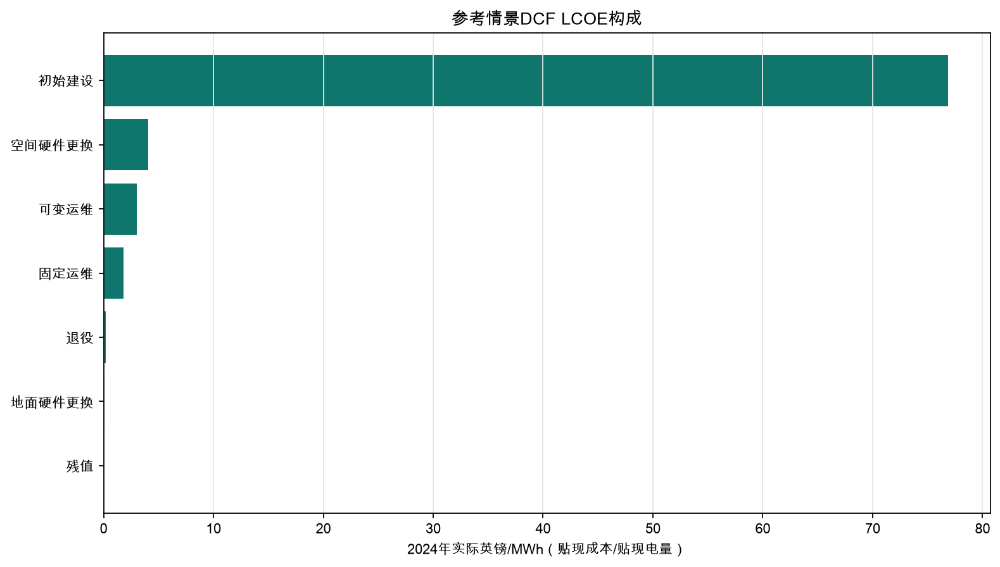
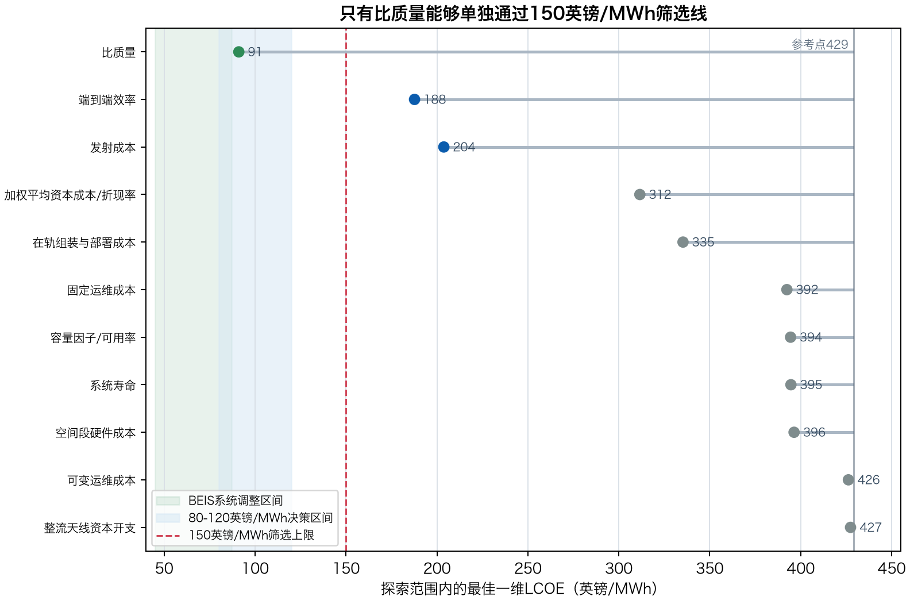
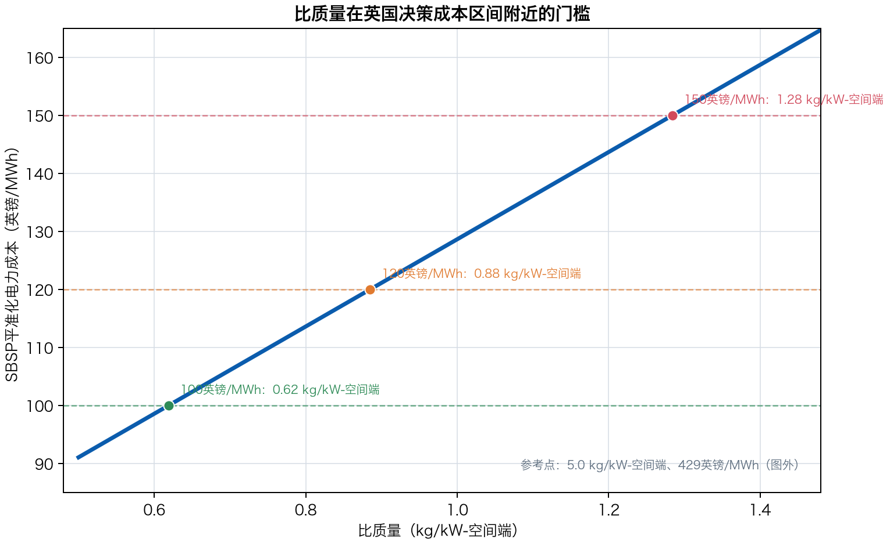
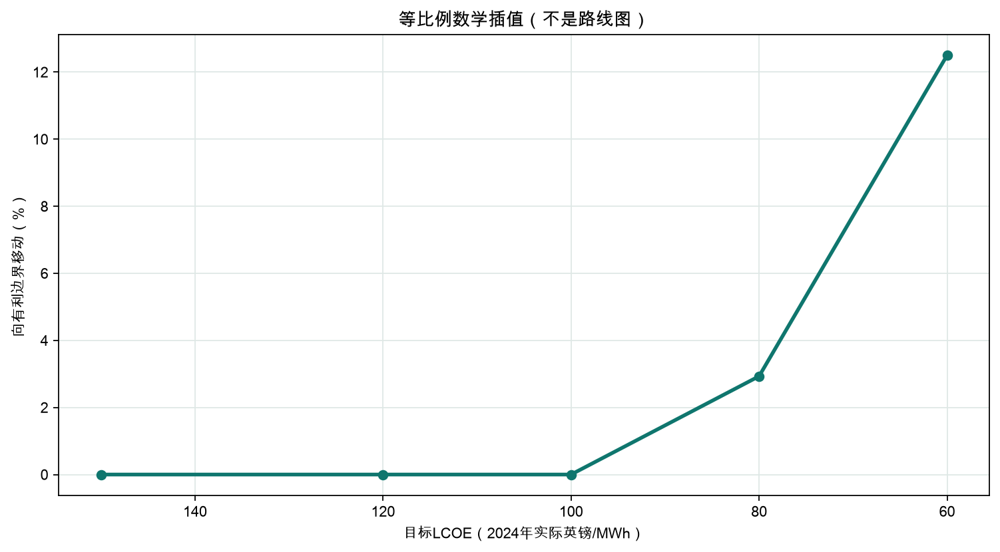

# 英国空间太阳能成本条件评估 - v2.0

副标题：基于明确技术与财务假设的并网交付平准化电力成本阈值分析

作者：Wenyu Gao

版本号：v2.0

报告日期：2026年7月28日

证据截止日期：2026年7月19日

项目仓库：[https://github.com/WenyuGao1/space-based-solar-power-lcoe-model](https://github.com/WenyuGao1/space-based-solar-power-lcoe-model)

交互模型：[https://wenyugao1.github.io/space-based-solar-power-lcoe-model/html/](https://wenyugao1.github.io/space-based-solar-power-lcoe-model/html/)

建议引用：Gao, W. (2026). 英国空间太阳能成本条件评估, v2.0。

免责声明：这是条件情景结果，不是商业预测、报价、英国官方目标或经济可行性证明。

## 技术摘要

本报告独立评估：在一组明确、可调整且可审计的假设下，2 GW英国并网空间太阳能系统的平准化电力成本可达到什么水平，以及哪些变量最能改变结果。参考情景得到 **£86.03/MWh**（2024年实际英镑）。该结果由贴现生命周期成本 **£13.10bn** 除以贴现交付电量 **152.32百万MWh** 得到。

- 参考情景假设2 GW并网交流交付、14.98%端到端效率、10.00百万kg（10,000吨）轨道硬件和118次等效发射。
- 贴现初始建设贡献约 **£76.86/MWh**，是£86.03/MWh参考结果的主要组成。
- 在各自探索范围内，系统比质量、至集结轨道发射成本和实际贴现率的单变量有利边界分别把LCOE降至 **£31.3、£49.5和£56.9/MWh**。这些是边界敏感性，不是联合可实现方案。
- 英国和NASA研究同样显示，成本结果高度依赖架构、发射、融资与组合有利假设；由于系统边界不同，外部区间只能用于背景与一致性检查，不能验证本模型的£86.03/MWh。

<!-- PAGEBREAK -->

## 研究问题、范围与核心定义

研究问题是：在不把情景结果误写成预测的前提下，哪些技术、部署、生命周期和融资条件能够让SBSP进入本研究定义的£80-120/MWh讨论区间？£80、£100、£120和£150/MWh均为分析筛选线，不是英国官方目标。

系统边界从并网点2 GW交流功率向上游反推至入射太阳功率。发射按kg计价且只覆盖至集结轨道；集结轨道为LEO服务边界，最终运行轨道为架构相关的高地球轨道。轨道转移代理必须覆盖转移器、推进剂、补给任务、运行和载荷性能惩罚。

| 核心定义或假设 | 参考情景 | 解释 |
| --- | --- | --- |
| 交付容量 | 2.00 GW AC | 并网连接点的额定交流功率 |
| 价格口径 | 2024年实际英镑 | 全部模型财务输入与输出 |
| 交付容量因子 | 90% | 可用率、停运和运行约束的合并代理 |
| 运行寿命 | 30年 | 调试完成后的完整运行年 |
| 实际贴现率 | 6.5% | 从建设开始t=0贴现 |
| 系统比质量 | 5.0 kg/kW-交付 | 每kW并网交付功率对应的整套轨道硬件质量 |
| 发射成本 | £500/kg | 仅至集结轨道 |

## 从2 GW并网交付反推分阶段能量链

| 阶段 | 额定功率 |
| --- | --- |
| 入射太阳功率 | 13.35 GW |
| 空间直流母线输出 | 4.67 GW |
| 射频发射功率 | 3.27 GW |
| 整流天线入射射频功率 | 3.21 GW |
| 整流天线直流输出 | 2.08 GW |
| 并网交流交付功率 | 2.00 GW |

计算所得端到端效率: **14.9822%**.

## 贴现现金流与成本边界

主指标采用 `LCOE = [sum_t C_t / (1+r)^t] / [sum_t E_t / (1+r)^t]`。估值基准为建设开始t=0；4年建设支出采用相等份额，调试完成后的首个运行年现金流位于t=5。运行寿命为30年，首年交付电量为15.77 TWh，寿命期年均交付电量为14.68 TWh。简单CRF对账结果为£71.02/MWh，仅作次要核对，因为它不复制完整建设期时点。

轨道质量 = 交付容量(kW) x kg/kW-交付；不会再除以链路效率。空间发电、射频发射、整流天线和并网成本分别按各自额定功率边界计价，避免把同一功率或成本重复计算。空间更换包含相应硬件、发射、转移和组装；地面更换只包含整流天线和并网。固定运维基数不含预备费、初始发射、转移和组装。

默认建设支出曲线为 `[0.25, 0.25, 0.25, 0.25]`，合计100%。项目预备费只对初始资本开支计提一次。期末退役作为成本，残值在运行寿命结束时抵扣。

## 参考成本由前期建设主导

| 资本开支项目 | 2024年实际英镑 |
| --- | --- |
| 发射至集结轨道 | £5.00bn |
| 在轨组装与部署 | £2.00bn |
| 空间发电硬件 | £1.87bn |
| 转移至运行轨道 | £1.00bn |
| 射频发射硬件 | £0.33bn |
| 整流天线 | £0.30bn |
| 并网连接 | £0.20bn |
| 项目预备费 | £2.14bn |
| 初始资本开支合计 | £12.84bn |

| 生命周期项目 | 贴现现值 | LCOE贡献 |
| --- | --- | --- |
| 初始建设 | £11.71bn | £76.86/MWh |
| 空间硬件更换 | £0.62bn | £4.08/MWh |
| 可变运维 | £0.46bn | £3.00/MWh |
| 固定运维 | £0.27bn | £1.80/MWh |
| 退役 | £0.03bn | £0.20/MWh |
| 地面硬件更换 | £0.02bn | £0.10/MWh |
| 残值 | £0.00bn | £0.00/MWh |

贴现初始建设贡献 **£76.86/MWh**，因此参考结果对初始资本开支、建设时点和融资条件特别敏感。其余生命周期项目不能忽略，但不会改变“前期资本密集”这一主导结构。

## 比质量、发射与融资是最强单变量驱动

| 参数 | 有利边界下LCOE | 相对参考情景降低 |
| --- | --- | --- |
| 系统比质量 | £31.3/MWh | £54.7/MWh |
| 至集结轨道发射服务成本 | £49.5/MWh | £36.5/MWh |
| 实际项目贴现率 | £56.9/MWh | £29.1/MWh |
| 在轨组装与部署成本 | £70.8/MWh | £15.2/MWh |
| 空间发电硬件成本 | £72.5/MWh | £13.5/MWh |
| 初始项目预备费 | £73.2/MWh | £12.8/MWh |
| 建设期 | £74.7/MWh | £11.4/MWh |
| 集结至运行轨道转移成本 | £78.4/MWh | £7.6/MWh |

每根柱表示只把该参数移动到有利探索边界时的LCOE；其余输入保持参考值。较低的柱表示更强的单变量影响，而不是更高的实现概率。

## 单变量阈值说明进入目标区间所需条件

下表列出最具决策意义的单变量阈值：每一行只改变一个参数，其余输入保持参考值。它回答“单独需要到什么水平”，而不声称该水平能够按某一时间表实现。

| 目标LCOE | 单变量 | 达到目标的条件 |
| --- | --- | --- |
| £80/MWh | 系统比质量 | 不高于 4.5 kg/kW-交付 |
| £80/MWh | 至集结轨道发射服务成本 | 不高于 £421/kg（至集结轨道） |
| £80/MWh | 实际项目贴现率 | 不高于 5.85% |
| £80/MWh | 空间发电硬件成本 | 不高于 £0.244/W-直流 |
| £80/MWh | 建设期 | 不高于 1 年 |
| £60/MWh | 系统比质量 | 不高于 2.86 kg/kW-交付 |
| £60/MWh | 至集结轨道发射服务成本 | 不高于 £158/kg（至集结轨道） |
| £60/MWh | 实际项目贴现率 | 不高于 3.42% |

| 目标 | 等比例移动 | 计算所得链路效率 |
| --- | --- | --- |
| £150/MWh | 0.0% | 14.98% |
| £120/MWh | 0.0% | 14.98% |
| £100/MWh | 0.0% | 14.98% |
| £80/MWh | 2.9% | 15.36% |
| £60/MWh | 12.5% | 16.64% |

参考情景已经低于£150、£120和£100/MWh，因此这些目标在等比例表中显示0.0%移动。£80和£60/MWh需要沿全部有利边界进行数学插值；该前沿不是成熟度、概率、预测、进度表或工程路线图。

比质量同时作用于发射、轨道转移、在轨组装和后续空间更换，因此其影响并不等同于单纯减少某一项硬件采购成本。图中的线性趋势来自当前按kg计价边界；真实任务还会受到离散发射次数、结构和运载器集成约束。

## 与已发表SBSP研究的关系

本报告没有把外部研究中的情景数字直接写成本模型默认值。29项默认值均为本研究设定的探索性假设；外部资料只承担技术背景、范围启发、定义核对或一致性比较角色。

| 研究 | 公开成本背景 | 与本模型一起阅读时的限制 |
| --- | --- | --- |
| 英国SBSP第二阶段研究（2021） | 2018年价格：£35-79/MWh（p10-p90），p50约£50/MWh；2040年投运情景。 | 提供架构与未来情景背景；成熟度、融资、价格与成本边界不同，不能直接比较。 |
| DESNZ小规模SBSP研究（2026年发布） | 2024年英镑：2030年£335-595/MWh、2035年£154-249/MWh、2040年£87-129/MWh。 | 提供当前英国架构与系统价值背景；规模、轨道、采购和门槛收益率不同，区间重叠不构成验证。 |
| NASA OTPS评估（2024） | 2022财年美元：基准情景$610/$1,590每MWh；组合有利假设下$30/$80每MWh。 | 说明组合有利假设的重要性；本模型没有直接采用NASA成本值。 |

这些研究的结果跨度很大，恰好说明SBSP成本不能脱离架构、成熟度、融资和系统边界讨论。本模型的不同之处是公开连续参数阈值、成本分母和可执行计算，而不是声称比固定年份的架构研究更有预测力。

## 验证、不确定性与剩余限制

自动化验证覆盖：比功率与比质量倒数换算、2 GW质量回归、不重复除以效率、六级功率、额定成本分配、发射模式互斥、发射次数取整、更换基数、建设支出份额、DCF/CRF收敛、零贴现率、无效输入、Python与浏览器一致性、中英数值一致性及完整重建。

- 没有天线面积、频率、波束几何、旁瓣、功率密度、土地、天气或安全约束的物理设计。
- 没有飞行器清单、结构载荷、热控、辐射、故障、备件、离散更换任务或详细发射排程。
- 没有税务、通胀、融资分层、学习曲线或架构参数相关性。
- 没有英国电力系统调度、网络增强、平衡、容量价值或市场收入模型。
- 探索范围不是概率分布，因此不输出P10/P50/P90，也不能把单变量有利边界同时视为最可能发生。

由可执行模型生成。价格年份：2024年实际英镑。估值基准：建设开始（t=0）。

## 结论与下一步

在本研究边界内，参考情景的 **£86.03/MWh** 已进入研究定义的£80-120/MWh讨论区间，并低于£100/MWh筛选线。模型还表明，在其余假设保持参考值时，仅降低至集结轨道发射成本就可以跨越£80或£60/MWh阈值；但这是一项条件敏感性结论，不等于对运载器成熟度、项目工期、系统安全或融资可得性的预测。更稳健的表述是：SBSP存在可量化的低成本条件空间，而这些条件是否能够在同一可建造架构中同时成立，仍需工程与融资证据。

优先开展以下工作：

- 用具体架构的物料清单、结构裕度和地面交付比功率替换探索性系统比质量。
- 建立离散发射清单、轨道转移与补给方案，并核对按kg价格是否代表可采购服务。
- 加入波束、整流天线、土地、安全、天气和电网接入的物理及监管约束。
- 把贴现率、建设延误、失效与更换设为相关概率变量，形成P10/P50/P90结果。

<!-- PAGEBREAK -->

## 附录A：完整参数登记表

该登记表保留全部29项默认值、探索范围、成本或功率分母及局限，供复核使用。正文结论不应脱离这些边界解释。

| 参数 | 参考值 | 探索范围 | 分母/边界 | 限制 |
| --- | --- | --- | --- | --- |
| 电网交付容量 | 2000 MW并网交流交付 | 500-5000 | 并网点交流电功率 | 规模输入；简化模型近似规模中性。 |
| 太阳能至直流转换效率 | 0.35 比例 | 0.2-0.45 | 入射太阳功率至空间直流母线输出 | 取决于架构的探索值；并非经独立验证的飞行系统数值。 |
| 直流至射频效率 | 0.7 比例 | 0.4-0.85 | 空间直流母线输入至射频发射功率 | 不含传播和整流天线转换损耗。 |
| 射频传输效率 | 0.98 比例 | 0.85-0.995 | 射频发射功率至整流天线入射射频功率 | 简化的波束捕获代理；未显式建模波束几何旁瓣天气及安全约束。 |
| 整流天线射频至直流效率 | 0.65 比例 | 0.4-0.85 | 整流天线入射射频功率至直流输出 | 探索性的系统平均转换代理。 |
| 直流至并网交流效率 | 0.96 比例 | 0.9-0.99 | 整流天线直流输出至并网点交流功率 | 仅包含简化逆变及本地电气损耗。 |
| 交付容量因子 | 0.9 比例 | 0.6-0.98 | 年度交流电量除以额定交付交流容量与8760小时的乘积 | 综合可用率停机与运行约束；并非实测预测。 |
| 投运后运行寿命 | 30 年 | 15-45 | 调试完成后的完整运行年数 | 工程退役与经济寿命被简化为同一时长。 |
| 实际项目贴现率 | 0.065 比例 | 0.03-0.2 | 从建设开始t=0时点贴现 | 并非实测SBSP加权资本成本；不含税务融资分层与通胀。 |
| 建设期 | 4 年 | 0-8 | 从估值基准时点至调试完成的年数 | 默认采用年度等额支出；未体现项目特定进度。 |
| 年度交付出力衰减 | 0.005 比例/年 | 0-0.03 | 首个运行年后交付交流电量的逐年降幅 | 简化的系统平均衰减代理。 |
| 系统比质量 | 5 kg/kW-交付 | 0.5-10 | 每千瓦并网交流交付功率对应的完整在轨运行硬件质量 | 交付功率口径；不得再次除以效率。公开数值可能取决于架构或来自厂商声明。 |
| 空间发电硬件成本 | 0.4 英镑/W-直流 | 0.05-5 | 空间直流母线额定输出且不含射频发射硬件 | 仅含采集结构转换和直流调理；与发射机成本边界互斥。 |
| 射频发射硬件成本 | 0.1 英镑/W-射频发射 | 0.02-1 | 射频额定发射功率且不含发电与直流母线硬件 | 仅含直流至射频转换和发射孔径硬件；不重复计入发电硬件。 |
| 至集结轨道发射服务成本 | 500 英镑/kg（至集结轨道） | 20-5000 | 交付至指定近地集结轨道边界的运行轨道硬件质量 | 并非地球同步轨道交付报价；采购节奏集成与目的轨道会显著影响价格。 |
| 单次发射价格 | 1e+08 英镑/次 | 1e+07-3e+08 | 一次至集结轨道且与按公斤计价互斥的发射 | 仅在按次计价模式启用时使用；绝不与按公斤成本相加。 |
| 单次有效载荷 | 100000 kg/次 | 20000-250000 | 每次到达集结轨道的最大配载硬件质量 | 取决于运载器与轨道；两种计价模式均用于发射次数诊断。 |
| 载荷利用率 | 0.85 比例 | 0.5-1 | 有效载荷能力的平均使用比例 | 未建模包装体积进度或拼单限制。 |
| 集结至运行轨道转移成本 | 100 英镑/kg（最终硬件） | 0-3000 | 从集结轨道转移至运行轨道的最终运行硬件 | 必须覆盖转移器推进剂补给任务运行及载荷惩罚；低值不能证明高轨交付低廉。 |
| 在轨组装与部署成本 | 200 英镑/kg（运行硬件） | 0-3000 | 完成组装部署与调试的运行轨道硬件 | 探索性预留；机器人作业检查备件和调试被捆绑处理。 |
| 整流天线成本 | 0.15 英镑/W-交流交付 | 0.02-1 | 并网边界额定交流交付功率 | 捆绑代理；未显式建模天线面积频率波束几何旁瓣功率密度土地天气和安全。 |
| 并网成本 | 100 英镑/kW-交流交付 | 20-300 | 并网点额定交流功率 | 简化的本地并网预留；不含更广泛输电网增强。 |
| 初始项目预备费 | 0.2 初始资本开支（预备费前）比例 | 0-0.5 | 仅一次应用于预备费前初始建设资本开支 | 不递归应用于年度运维或更换预留。 |
| 空间硬件更换率 | 0.006 比例/年 | 0-0.03 | 每年更换的合格空间硬件及其相关发射转移和组装成本比例 | 以简化年度等效方式处理而非离散故障与物流排程。 |
| 地面硬件更换率 | 0.003 比例/年 | 0-0.02 | 每年更换的合格整流天线与并网成本比例 | 未建模各部件特定更换周期。 |
| 固定运维率 | 0.01 比例/年 | 0.002-0.05 | 仅应用于发电发射整流天线和并网资产 | 其基数不含预备费初始发射转移和组装。 |
| 可变运维 | 3 英镑/MWh交付 | 0-20 | 并网边界每兆瓦时交流交付电量 | 探索性预留；不含市场费用及下游系统成本。 |
| 期末退役成本 | 0.02 初始资本开支比例 | 0-0.2 | 运行寿命结束时应用于初始资本开支 | 时点与处置义务被简化。 |
| 期末残值 | 0 初始资本开支比例 | 0-0.2 | 运行寿命结束时相对于初始资本开支的抵扣 | 默认无残值抵扣；回收市场与责任存在不确定性。 |

## 附录B：外部证据映射

下表把参数与论断连接到可核查的外部证据，并给出文档位置和可比性限制。除非明确标注，文献数值没有直接替换模型默认值。

| 参数/论断 | 证据角色 | 外部来源与位置 | 证据背景及可比性限制 |
| --- | --- | --- | --- |
| 电网交付容量 | 外部先例 | UK_SBSP_2021_PHASE2 · PDF pp.18-19 | 2021年特定架构案例采用2 GW交付容量。 数值背景：2 GW CASSIOPeiA案例。可比性限制：本项目把相同数值作为规模锚点，不代表该架构最优。 |
| 系统运行寿命 | 外部先例 | UK_SBSP_2021_PHASE2 · PDF pp.18-19 | 2021年公用事业级经济案例采用30年寿命。 数值背景：30年；后续小规模研究采用15年。可比性限制：寿命取决于架构；本模型不证明生存性或翻新可行性。 |
| 计算所得端到端效率 | 技术背景 | CALTECH_SBSP_2022 · abstract | 轻量化模块概念报告了显著的全链路损耗。 数值背景：端到端效率7%–14%。可比性限制：概念与子系统边界不同；该数值只用于核对计算输出而非模型输入。 |
| 计算所得端到端效率 | 有外部启发的假设 | UK_SBSP_2021_ANNEX_B · PDF p.4 | 公开的分级效率乘积为分阶段能量链提供背景。 数值背景：独立效率分量乘积约14.85%–24.39%。可比性限制：独立极值既不定义概率分布，也不代表已验证的集成设计。 |
| 计算所得端到端效率 | 外部一致性核对 | DESNZ_SBSP_2025 · Table 1, PDF pp.11-12; reference-design selection p.13 | 官方小规模研究给出架构级总效率案例。 数值背景：11.7%–19.9%；所选Space Solar小规模参考设计14.9%。可比性限制：主要数值可能来自厂商声明或推断且定义可能不同。 |
| 交付容量因子 | 适用范围限定 | DESNZ_SBSP_2025 · Table 3, PDF p.16 | 官方研究显示，利用率会随轨道和统计边界显著变化。 数值背景：HEO：英国整流天线95.7%、卫星平均53.9%；圆形LEO：卫星平均20.1%、英国整流天线21.5%。可比性限制：整流天线利用率不等同于本模型交付容量因子；90%仍是研究假设。 |
| 系统比质量 | 技术背景 | CALTECH_SBSP_2022 · abstract | 轻量化结构是模块化空间太阳能架构的核心。 数值背景：面密度160 g/m²。可比性限制：缺少完整交付功率与子系统边界时，面密度不能换算为整套系统kg/kW-交付。 |
| 系统比质量 | 外部一致性核对 | DESNZ_SBSP_2025 · Table 1, PDF pp.11-12; reference-design selection p.13 | 架构比功率是单位轨道质量对应的地面交付功率；其倒数为kg/kW-交付。 数值背景：0.15–0.67 kW-交付/kg；0.67换算为1.4925 kg/kW-交付。可比性限制：数值取决于架构且部分来自厂商声明；换算不验证工程成熟度，模型默认值仍属探索性。 |
| 至集结轨道发射服务成本 | 外部范围 | UK_SBSP_2021_ANNEX_B · PDF p.5 and p.11 | 2021年输入审查采用宽范围的特定架构航天运输成本。 数值背景：£358–2,410/kg。可比性限制：轨道采购价格年份和服务边界均不同于本模型集结轨道变量。 |
| 至集结轨道发射服务成本 | 外部比较 | DESNZ_SBSP_2025 · Table 12 p.37; Tables 27-28 pp.71-73 | 发射成本是官方小规模案例的主导驱动因素。 数值背景：2030/35/40年中心HEO为£1,647/1,400/1,153每kg；乐观值£1,188/1,008/827。可比性限制：高轨交付不能直接等同于集结轨道服务加探索性转移代理。 |
| 至集结轨道发射服务成本 | 外部先例 | NASA_OTPS_SBSP_2024 · PDF p.10 | NASA有利组合案例包含低发射价格假设。 数值背景：名义$500/kg；15%批量折扣后$425/kg。可比性限制：采用FY2022美元及美国采购/架构边界；本项目不直接移植。 |
| 实际项目贴现率 | 融资背景 | DESNZ_SBSP_2025 · Table 12 p.37; Table 26 pp.68-69 | 公开空间太阳能案例采用随成熟度和投资者类别下降的实际税前门槛收益率。 数值背景：情景门槛收益率20%/13.2%/9.06%；投资者案例14.9%至4.83%。可比性限制：门槛收益率不等同于项目贴现率；6.5%仍是研究假设。 |
| 实际项目贴现率 | 有外部启发的假设 | DESNZ_EGC_2025_ANNEX_A · Technical and Cost Assumptions, row 38 | 部分成熟地面发电技术采用6.5%门槛收益率输入。 数值背景：大型光伏和陆上风电为6.5%。可比性限制：这不是实测SBSP贴现率，也未定义税务或融资结构。 |
| 并网成本 | 有外部启发的假设 | DESNZ_SBSP_2025 · PDF p.70 | 小规模研究给出按MW计的并网基础设施预留。 数值背景：£0.15m/MW，即£150/kW。可比性限制：本模型自定£100/kW简化预留；范围和场址条件可能不同。 |
| 固定运维 | 有外部启发的假设 | UK_SBSP_2021_ANNEX_B · Table B1, PDF p.4 | Annex B采用由地面发电技术推导的三角分布运维系数。 数值背景：三角分布下限/众数/上限为0.8%/1.9%/4.7%。可比性限制：定义与成本基数不同；本模型每年1% CAPEX仍是研究假设。 |
| 参考情景LCOE | 外部一致性核对 | DESNZ_SBSP_2025 · executive summary, PDF pp.3-4 | 本项目锚点落在一个公开的早期小规模区间内。 数值背景：2024英镑：2030年£335–595/MWh、2035年£154–249、2040年£87–129。可比性限制：这不是验证：规模、架构、轨道、情景年份、融资和会计边界均不同。 |
| 外部低成本情景 | 外部比较 | UK_SBSP_2021_PHASE2 · Executive summary p.3; assumptions pp.18-19; Figure 5 p.22 and Table 4 p.23 | 较早英国架构研究报告了明显更低的未来案例。 数值背景：2018年价格下p10–p90为£35–79/MWh、p50约£50/MWh；2 GW；30年；20%门槛收益率。可比性限制：架构、学习、投产年份、融资和价格口径不同；不能按同口径预测直接排序。 |
| 架构依赖性 | 外部比较 | NASA_OTPS_SBSP_2024 · executive summary pp.3-4; pp.7-10 | NASA所选基线与有利组合案例的生命周期成本相差约20倍。 数值背景：FY2022美元：基线$610/$1,590每MWh；有利组合$30/$80每MWh。可比性限制：美国架构、服务曲线、币种和生命周期边界不同；NASA数值不导入本模型。 |
| 发射成本重要性 | 适用范围限定 | DESNZ_SBSP_2025 · Table 14, PDF p.38 | 官方小规模研究把大部分LCOE方差归因于发射假设。 数值背景：2030/35/40年分别为55.5%/62.9%/64.0%。可比性限制：本项目在自身一维范围内可能把比质量排第一；两种排名都不是普遍规律。 |
| 电力系统价值 | 系统背景 | DESNZ_SBSP_2025 · executive summary, PDF pp.3-4 | 官方系统案例对每个公开LCOE采用相同系统收益调整。 数值背景：计入系统收益后，所有案例LCOE均降低£21/MWh。可比性限制：本模型不把全系统价值货币化，也不从项目LCOE中扣除£21/MWh。 |
| 系统调整成本比较 | 基准定义 | BEIS_EGC_2020 · Tables 7.1-7.3 | 增强LCOE说明更广泛系统影响会改变技术比较。 数值背景：整理区间保存在uk_system_adjusted_costs.csv。可比性限制：采用2018年实际英镑且依赖情景；仅作指示，未与本模型2024年实际英镑直接统一。 |

## 附录C：方法纠正与版本记录

v1.x把一个本应按交付功率定义的1.5 kg/kW数值乘以“交付功率/效率”，从而重复除以效率。在2 GW、20%效率示例中，旧公式得到 **15,000,000 kg（15,000吨）**，正确公式得到 **3,000,000 kg（3,000吨）**。在其余v2输入相同的对比计算中，错误质量边界对应 **£116.45/MWh**，正确边界对应 **£43.45/MWh**。因此历史v1.x阈值与v2.0不可直接比较。

DESNZ/Frazer-Nash报告把架构比功率定义为地面交付功率/轨道质量；0.67 kW-交付/kg的倒数为 **1.4925 kg/kW-交付**（Table 1, PDF pp.11-12; reference-design selection p.13）。数值仍取决于架构，且部分来自未经独立验证的厂商声明。

<!-- PAGEBREAK -->

## 参考文献

`ASSUMPTION_THIS_STUDY` 是项目内部假设记录，不是外部文献。以下列表只收录证据映射实际引用的外部资料，并按来源编号去重。

- **DESNZ_EGC_2025_ANNEX_A** — Department for Energy Security and Net Zero（2026-01-14）。[Annex A: Additional estimates and key assumptions 2025](https://assets.publishing.service.gov.uk/media/69d8efec96c86b7513170229/annex-a-additional-estimates-and-key-assumptions-2025.xlsx)。本报告用途：UK generation benchmark input workbook。访问日期：2026-07-19。
- **BEIS_EGC_2020** — Department for Business, Energy and Industrial Strategy（2020-08-24）。[BEIS Electricity Generation Costs (2020)](https://www.gov.uk/government/publications/beis-electricity-generation-costs-2020)。本报告用途：System-adjusted benchmark source。访问日期：2026-07-19。
- **UK_SBSP_2021_PHASE2** — Frazer-Nash Consultancy for BEIS（2021-04-23）。[Space Based Solar Power as a Contributor to Net Zero — Phase 2: Economic Feasibility](https://www.fnc.co.uk/media/ae2eadpi/fnc-004456-51624r-phase-2-economic-feasibility-issue-1-1.pdf)。本报告用途：External SBSP economic study。访问日期：2026-07-19。
- **UK_SBSP_2021_ANNEX_B** — Frazer-Nash Consultancy for BEIS（2021-04-23）。[Space Based Solar Power as a Contributor to Net Zero — Phase 2: Economic Feasibility – Annex B: Input Data Sources](https://www.fnc.co.uk/media/jfhdqus0/fnc-004456-51624r-phase-2-annex-b-input-data-sources.pdf)。本报告用途：External SBSP input evidence。访问日期：2026-07-19。
- **DESNZ_SBSP_2025** — Frazer-Nash Consultancy; Space Solar Engineering Ltd; Imperial College London for DESNZ（2026-02-13）。[Feasibility of Small-Scale Space Based Solar Power (SBSP) Systems for Early Market Adoption](https://assets.publishing.service.gov.uk/media/698f167c7da91680ad7f43ad/SBSP-enabled-pathways-to-net-zero-final-report-raf036-2425.pdf)。本报告用途：External SBSP study。访问日期：2026-07-19。
- **NASA_OTPS_SBSP_2024** — NASA Office of Technology, Policy, and Strategy（2024-01-11）。[Space Based Solar Power](https://ntrs.nasa.gov/citations/20230018600)。本报告用途：External SBSP study。访问日期：2026-07-19。
- **CALTECH_SBSP_2022** — Caltech Space Solar Power Project（2022-06-16）。[A Lightweight Space-based Solar Power Generation and Transmission Satellite](https://arxiv.org/abs/2206.08373)。本报告用途：SBSP technical context。访问日期：2026-07-19。
