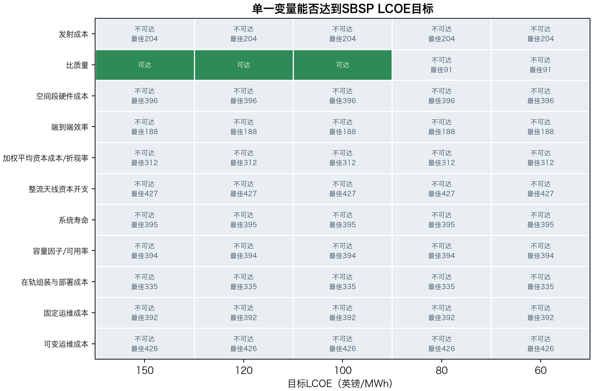

# 英国空间太阳能成本门槛评估

副标题：面向英国稳定低碳电力的决策型技术经济评估

证据状态：项目证据登记表和官方来源文件复核至2026年7月10日。

版本号：v1.1 决策窗口修订版

说明：使用本项目数据与模型流水线生成的可复现成本门槛评估。

免责声明：本报告识别进入进一步评估的成本条件，不证明工程可行性、商业成熟度或投资价值。

[[PAGEBREAK]]

## 目录

- 1. 执行决策摘要
- 2. 范围与方法
- 3. 参考点与成本结构
- 4. 英国成本基准
- 5. 一维成本门槛
- 6. 综合瓶颈门槛
- 7. 决策含义与局限
- 附录A. 完整一维诊断
- 附录B. 来源登记表
- 附录C. 假设分类

[[PAGEBREAK]]

## 1. 执行决策摘要

参考点的并网交付LCOE为429英镑/MWh。它是分析锚点，不是预测或优选设计。真正有用的结果是其下方的成本门槛结构。

表1. 成本门槛及其决策含义

| 成本门槛 | 解释 | 决策含义 |
| --- | --- | --- |
| 低于150英镑/MWh | 宽口径筛选上限 | 接近较高成本参照，但不代表具备竞争力 |
| 100-120英镑/MWh | 稳定低碳电力决策区间 | 应启动工程、融资和英国系统价值评估 |
| 80英镑/MWh及以下 | 保守系统调整区间开始重叠 | 成本具有相关性，但仍须校核价格口径和系统价值 |
| 60英镑/MWh | 严格延伸目标 | 需要多数瓶颈同步改善 |

本评估有三项核心发现：

- 只有比质量能够单独通过150英镑/MWh筛选线。在其他输入固定时，150、120和100英镑/MWh分别要求约1.28、0.88和0.62 kg/kW-空间端。
- 发射成本即使降至20英镑/kg，最佳一维结果仍为204英镑/MWh；端到端效率提高至35%时，最佳一维结果仍为188英镑/MWh。
- 进入80-120英镑/MWh区间，需要质量、效率、发射、组装、轨道硬件和融资条件共同改善。

空间太阳能进入80-120英镑/MWh，只意味着值得开展更深入的工程和英国电力系统建模，不意味着自动具备市场竞争力。

## 2. 范围与方法

模型研究发射成本、质量强度、硬件成本、在轨组装成本、效率、利用率、寿命、运维和融资条件降到什么水平时，空间太阳能可以接近英国电力成本基准。

模型边界为并网交付LCOE。年化初始CAPEX、固定运维、翻新预留和可变运维之和除以年交付MWh。年交付电量等于并网容量乘以8,760小时和容量因子；所需空间端功率等于并网容量除以端到端效率；轨道质量等于空间端功率乘以比质量。

模型只识别成本平价。工程可实现性、波束与频谱监管、建设交付、商业融资和完整系统价值均需要独立检验。

## 3. 参考点与成本结构

表2. 核心参考输入

| 参数 | 参考值 | 作用 |
| --- | --- | --- |
| 并网交付容量 | 2,000 MW | 规模锚点 |
| 端到端效率 | 15.0% | 决定空间端功率和质量 |
| 容量因子/可用率 | 90.0% | 决定年交付电量 |
| 比质量 | 5.0 kg/kW-空间端 | 同时放大发射、转移和组装成本 |
| 发射成本 | 500 英镑/kg至中转轨道 | 主要运输成本杠杆 |
| 空间段硬件成本 | 0.40 英镑/W-空间端 | 轨道制造成本杠杆 |
| 在轨组装与部署成本 | 200 英镑/kg | 随质量缩放的部署成本 |
| 加权平均资本成本/折现率 | 6.5% | 决定资本开支年化水平 |
| 系统寿命 | 30 年 | 资本回收周期 |

在该参考点下，2 GW并网交付容量需要13.33 GW空间端功率和约66,667吨轨道硬件。

[[PAGEBREAK]]

表3. 包含项目裕度的初始CAPEX

| 组成部分 | 十亿英镑 |
| --- | --- |
| 发射 | 33.33 |
| 在轨组装与部署 | 13.33 |
| 轨道转移 | 6.67 |
| 空间段CAPEX | 5.33 |
| 无线输电硬件 | 1.33 |
| 整流天线 | 0.30 |
| 并网 | 0.20 |
| 项目裕度前小计 | 60.50 |
| 项目裕度/预备费 | 12.10 |
| 初始CAPEX总额 | 72.60 |

年化CAPEX约占参考LCOE的82%。因此，质量、空间端规模、硬件成本和融资条件决定主要门槛。

由于商业规模空间太阳能尚未部署，这些输入属于探索性假设。它们用于回答“什么条件必须改变”，而不是预测未来一定发生什么。

## 4. 英国成本基准

图中使用区间线而不是从零起点的柱形。80-120英镑/MWh是决策窗口，150英镑/MWh只是宽口径筛选上限。

表4. 基准解释

| 比较对象 | 指示性英镑/MWh | 价格口径 | 用途 |
| --- | --- | --- | --- |
| DESNZ发电成本区间 | 55-153 | 2024年实际英镑 | 发电机边界比较 |
| 成熟发电技术核心区间 | 55-113 | 2024年实际英镑 | 主文发电成本筛选线 |
| BEIS新能源系统调整区间 | 45-87 | 2018年实际英镑 | 保守指示值，不是完整英国系统模型 |
| 稳定低碳参照点 | 92.5合同价；104-105燃气CCUS | 价格口径不一 | 仅用于背景解释，不能视为单一同口径基准 |

DESNZ发电成本与BEIS增强LCOE不属于同一实际价格基年。图中明确标注这一差异，因此区间重叠不能被理解为已完成价格归一化的精确平价。电网、平衡、弃电、储能和可靠性成本还需要完整英国电力系统模型。

## 5. 一维成本门槛

一维分析只改变一个输入，其余输入保持参考值。它用于识别杠杆，不是技术开发计划。

该图删除了高成本恶化区间，只比较各输入向有利边界移动后的最佳结果。只有比质量能够单独通过150英镑/MWh筛选线。

图中只保留穿越150、120和100英镑/MWh的曲线部分，并明确注明5.0 kg/kW-空间端参考点位于视窗之外。

端到端效率为25%时，150英镑/MWh要求发射成本约109英镑/kg或更低；效率为35%时，100英镑/MWh要求约64英镑/kg。破折号表示探索范围内没有解。

结果很明确：低发射价格作用于重而低效的架构时，系统仍然过于昂贵。质量和效率决定发射与组装成本所作用的系统规模。

## 6. 综合瓶颈门槛

综合前沿把模型输入从参考值按相同比例推向其记录范围内的有利边界。下表的百分比是模型内归一化参数移动量，不代表技术成熟度、实现概率或日历进度。

表5. 选定综合门槛点

| 目标英镑/MWh | 归一化移动量 | 发射英镑/kg | 质量kg/kW | 效率 | WACC |
| --- | --- | --- | --- | --- | --- |
| 150 | 26% | 373 | 3.81 | 20% | 5.6% |
| 120 | 32% | 347 | 3.57 | 21% | 5.4% |
| 100 | 36% | 327 | 3.38 | 22% | 5.2% |
| 80 | 41% | 303 | 3.15 | 23% | 5.1% |

从150英镑/MWh筛选线上移到80-120英镑/MWh决策区间，需要多项物理和金融约束同时收紧。

图中只显示220英镑/MWh及以下区域，更高成本空间统一置灰，并突出150、120、100和80英镑/MWh等值线。

这些组合只是参数空间切片，不是工程路线图。替代切片仍保留在`data/processed/alternative_combined_pathways.csv`中。

## 7. 决策含义与局限

如果空间太阳能能够提供稳定或近稳定低碳输出，它在英国的相关比较对象应是可靠交付电力、燃气CCUS、类似核电的稳定供给、长时灵活性以及高比例新能源系统的调整后成本，而不只是风电和太阳能的裸发电LCOE。

可执行的决策规则是：低于150英镑/MWh时继续跟踪关键门槛；进入100-120英镑/MWh时开展集成工程与融资评估；达到80英镑/MWh及以下时，增加英国调度、电网和可靠性建模。

主要不确定性包括架构可实现性、成本范围可信度、融资风险、寿命与退化、波束与监管约束，以及稳定输出在未来英国系统中的价值。2018年BEIS与2024年DESNZ价格基年不同，报告继续明确保留这一差异，而不进行隐含换算。

核心结论可以压缩为一句话：空间太阳能不会仅靠降低发射成本进入决策范围；只有可信的集成架构进入约80-120英镑/MWh并网交付LCOE时，才值得开展下一层级评估。

[[PAGEBREAK]]

## 附录A. 完整一维诊断

主报告只展示决策相关视图。完整敏感性曲线仍保留在`figures_zh/`，全部曲线点保留在`data/processed/sensitivity_curves.csv`。

该矩阵保留五个成本目标和十一个变化输入的完整一维审计。

附录表A1. 完整一维门槛汇总

| 驱动因素 | 单位 | 150门槛 | 100门槛 | 最佳一维LCOE |
| --- | --- | --- | --- | --- |
| 发射成本 | 英镑/kg至中转轨道 | 未达到 | 未达到 | 204 |
| 比质量 | kg/kW-空间端 | 1.283 | 0.616 | 91 |
| 空间段硬件成本 | 英镑/W-空间端 | 未达到 | 未达到 | 396 |
| 端到端效率 | 比例 | 未达到 | 未达到 | 188 |
| 加权平均资本成本/折现率 | 比例 | 未达到 | 未达到 | 312 |
| 整流天线资本开支 | 英镑/W-交付端 | 未达到 | 未达到 | 427 |
| 系统寿命 | 年 | 未达到 | 未达到 | 395 |
| 容量因子/可用率 | 比例 | 未达到 | 未达到 | 394 |
| 在轨组装与部署成本 | 英镑/kg | 未达到 | 未达到 | 335 |
| 固定运维成本 | 比例/年 | 未达到 | 未达到 | 392 |
| 可变运维成本 | 英镑/MWh | 未达到 | 未达到 | 426 |

[[PAGEBREAK]]

## 附录B. 来源登记表

附录表B1. 来源登记表

| 来源ID | 参考资料 | URL |
| --- | --- | --- |
| DESNZ_EGC_2025 | DESNZ《2025年发电成本》 | https://www.gov.uk/government/publications/electricity-generation-costs-2025 |
| BEIS_EGC_2020 | BEIS《2020年发电成本》 | https://www.gov.uk/government/publications/beis-electricity-generation-costs-2020 |
| NESO_BALANCING_2025 | NESO《2025年度平衡成本报告》 | https://www.neso.energy/document/362561/download |
| NESO_NETWORK_UPDATE_2026 | NESO《2030年以后输电网络更新》 | https://www.neso.energy/publications/beyond-2030 |
| NESO_CP2030 | NESO《清洁电力2030建议及实施资料》 | https://www.neso.energy/publications/clean-power-2030 |
| NESO_OPERABILITY_2026 | NESO《可运行性战略报告与电力市场路线图》 | https://www.neso.energy/publications/operability-strategy-report-and-electricity-markets-roadmap |
| UKSA_SBSP_2020 | 英国航天局和BEIS空间太阳能研究委托 | https://www.gov.uk/government/news/uk-government-commissions-space-solar-power-stations-research |
| CALTECH_SBSP_2022 | 加州理工空间太阳能技术概念论文 | https://arxiv.org/abs/2206.08373 |
| NAO_HPC_2017 | 英国国家审计署《欣克利角C》 | https://www.nao.org.uk/reports/hinkley-point-c/ |

## 附录C. 假设分类

表C1中的参考输入均归类为探索性建模假设。运维及并网接口预留仍完整记录在`data/sbsp_parameters.csv`；官方原始工作簿、整理后CSV和模型输出分别保存，便于追溯。

附录表C1. 决策相关参考输入

| 参数 | 参考值 | 来源 | 解释 |
| --- | --- | --- | --- |
| 并网交付容量 | 2000.000 MW | `ASSUMPTION_THIS_STUDY` | 规模锚点。由于大多数成本按W或kg计, LCOE对规模大体中性。 |
| 端到端效率 | 15.0% | `CALTECH_SBSP_2022` | 从空间端所需功率到并网交付功率的探索性转换假设。 |
| 容量因子/可用率 | 90.0% | `ASSUMPTION_THIS_STUDY` | 近稳定输出的可用率假设, 不是SBSP运行历史观测值。 |
| 比质量 | 5.000 kg/kW-空间端 | `CALTECH_SBSP_2022` | 架构层面的质量强度, 是最强的一维驱动因素之一, 不确定性很高。 |
| 发射成本 | 500.000 英镑/kg至中转轨道 | `UKSA_SBSP_2020` | 全口径发射成本门槛变量, 作为宽范围探索变量而不是预测价格。 |
| 空间段硬件成本 | 0.400 英镑/W-空间端 | `ASSUMPTION_THIS_STUDY` | 轨道端采集、结构、控制和转换硬件的探索性制造成本门槛。 |
| 加权平均资本成本/折现率 | 6.5% | `DESNZ_EGC_2025` | 融资成本变量, 覆盖基础设施融资到较高风险项目融资的范围。 |
| 系统寿命 | 30.000 年 | `ASSUMPTION_THIS_STUDY` | 经济运行寿命。空间环境退化和翻新通过另一项预留表示。 |
| 在轨组装与部署成本 | 200.000 英镑/kg | `UKSA_SBSP_2020` | 机器人组装、部署、检查和调试成本的探索性假设。 |
| 整流天线资本开支 | 0.150 英镑/W-交付端 | `ASSUMPTION_THIS_STUDY` | 地面接收和转换系统按交付W计的探索性成本。 |
